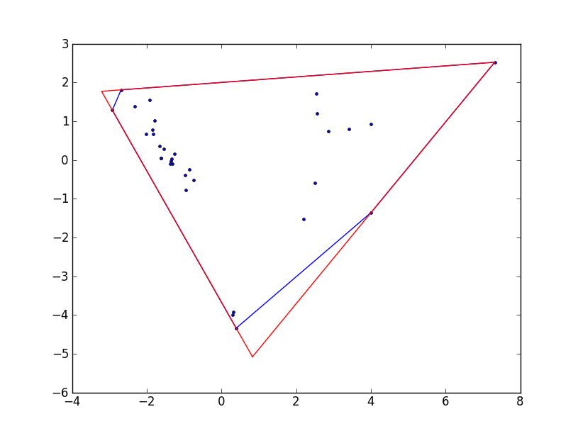

```{r setup, include=FALSE,echo=FALSE}
knitr::opts_chunk$set(fig.height = 10, fig.width = 15,echo = F)
```

## Highlights


* We show high interspecfic variation in network parameters of fungi which partly correlates with taxonomy
* We advocate the use of network properties as functional traits for fungal ecology.
* We show that network parameters reveal the trait space in mycelium architecture across species

## Introduction

The body of most fungal species consists of an interconnected network of filaments, yet fungal ecologists rarely use features of this network as fungal functional traits. We think not using network properties represents a missed opportunity because it is likely that the ecological success of fungi on land is partly due to such network growth  (Moore, D et al 2011). Indeed, such network body type has become a signature feature through the diversification of this kingdom (already present in basal clades (Stajich, J E et al 2009)) which showcase its versatility in response to ecological interactions. In this paper, we lay the foundation to gain understanding on the ecological significance of network properties in fungi by identifying traits that encapsulate the network-structure of fungi, measure their variation and link them to possible ecological strategies. 

We specifically identify traits that take into account the connection arrangement pattern of filaments once the mycelium is translated into a network graph (i.e. a set of nodes connected through edges Barthelemy et al 20XX). An approach was introduced and applied to fungi by  Fricker et al (20XX). In addition, in the calculation of these traits we use recent biophysical models of transport dynamics of nutrients and information within the mycelia when fungi are exploring for resources (Luke and Mark paper). During such an exploration phase, fungi transport resources located from a source (like a resource patch or spore reserves) to subsidize hyphal tip extension and branching (ref). Because of the extremely patchy distribution of resources in their soil habitat, we think it is very likely that fungi will be in the exploration phase for most of their lifetime. Thus, we consider that the traits we identify have a solid biological basis rooted in fungal anatomy and ecologically relevant scenarios. 

Second, we determine the degree of interspecific variation in network traits and whether it is related to phylogenetic affiliation across a diverse set of soil borne saprotrophic fungi. We included species in the Ascomycota, Basidiomycota and zygomycetous fungi (Mortierellomycota and Mucoromycota) and measured their network traits at both the micrometer and  macro (centimeter) scale. We consider using both scales is important as proof of concept of the usefulness of estimating network traits to describe the wide diversity of mycelial phenotypes found in nature. For example, zygoymecetous and ascomycete soil fungi typically produce mycelial networks composed of interconnected individual hyphae that span micrometer to millimeter scales through the soil (ref). In contrast, wood-decomposing basidiomycetes can produce networks consisting of cords (that results the fusion of several hyphae) that reach several centimeter in scale (ref).

Finally, we use the network traits to identify potential ecological strategies associated with differences in transport through the connected pattern arrangement of mycelia. To do this, we first determine how different the observed network properties are in comparison to a baseline network model that follows simple rules of minimized connectivity while maximizing transport. Thus, fungal networks closer to this model indicate a strategy that maximizes transport efficiency, while networks departing from it indicate fungi that increase the number of connections. Finally, we identify mycelial networks that represent extreme phenotypes (or archetypal phenotypes) in the network trait morphospace (Alon´s paper) based on the differences in network properties. These archetypes represent extreme points in the realized mycelium morphospace.


## Material and methods

## Fungal species

We used 13 fungi belogning to zygomycetous groups (Mucor fragilis, Mortierella sp, Mortierella elongata, Mortierella alpina, Mucor fragilis, Umbelopsis isabelina), Ascomycota (Fusarium redolens, Fusarium oxysporum, Fusarium solani, Alternaria sp) and Basidiomycota (Resinicium bicolor, Phanerochaete velutina and Phallus impudicus). The zygomycetous fungi and ascomycete fungi were selected from a pool of 30 fungal species which were all isolated from soil samples collected in semi-natural grassland in northeastern Germany (Diana paper) and maintained in the live culture collection at FU-Berlin. The species used here were selected because they had similar colony margin extension rates (which facilitates having common settings during microscopy, see below) and, although phylogenetically similar, produce distinctive mycelial phenotypes (Fig X [These should be pictures of the mycelia]).

Basidiomycets come from...


### Microphotography and image processing

For ascomycete, and zygomycetous fungi, we extracted network parameters from pictures of 10-to-14 hours-old, 2mm-diameter fungal mycelium growing on water agar with no resources added (the mycelium was growing out of an agar plug to which 10ul 10% Potato Dextrose Broth were added). Pictures were taken under a stereoscope (AxioZoom, Zeiss) by tiling 7 x 7 frames which were later stitched together using Zen Blue software form Zeiss. For basidiomycete fungi, pictures were taken of 20-cm-diameter fungal mycelium growing on a wooden block on inert sand so that all resources for growth are located in the wooden block[To be added: picture settings, age of the mycelia]. Thus, although the pictures come from different sizes and settings, both conditions reflect the exploration phase of the mycelium. Each fungal species was replicated three times.

Then we used a bundle of image processing algorithms to segment the images, determine the connected patterns among hyphae (i.e. which hypha is connected to which), and estimate hyphal traits such as widths (these algorithms are wrapped in the MatLab App “Fungal Networks” developed by Mark Fricker). This information was then stored in two matrices: an “edge list” containing a list of all pairs of nodes (i.e. hyphae) and the traits of the hyphae. The second matrix contains the position of the nodes in x, y coordinates.


### Graph network representation

The outputs from the image-processing step were used to translate each mycelium picture into “spatially explicit weighted graph network” (Fig 1), where:

 + Nodes represent hyphal tips, branching points, and anastomosis points. These three node types are distinguished based on the amount of nodes they are connected from/to (that is, the degree of the node). For example, hyphal tips have degree = 1, as they connect only to one other node, while branching points have degree = 2 because they connect to two other “daughter” nodes.
+ Edges (links) represent the hyphae. These are defined as links connecting two nodes.
+ Edge attributes represent hyphal traits (such as length and width)
+ Edge weight represents the transport resistance of the hyphae (see explanation below).


### Calculation of mycelial traits

From the network graph we calculated several traits as means of hyphal attributes (e.g. widths, lengths, accessibility resistances) and network connectivity properties (e.g. degree, centrality metrics) see supplementary table 1). From this complete set, we narrow  our analysis to 12 traits for each fungal colony (see table 1 for details) based on screenings on mathematical relationships between traits, frequency distribution properties and potential biological meaning. Five of those selected traits we classified as “hyphal attributes” representing direct average measurements of hyphal traits that are not directly related to the connected arrangement of hyphae. The other traits, which are directly dependent on the connectedness arrangement, we refer to as “network traits” and include:

+ Normalized coefficients that illustrate deviations of an observed metric (e.g. number of nodes or links) from a (hypothetical) fully connected network (where all nodes are linked to each other). These coefficients are taken from transportation geography (Fricker et al. X);

+ Transport efficiencies, which summarize the efficiency of transporting material throughout the network following the assumptions of the “Hydraulic Hyphal transport Model.” Under this model, connected hyphae are idealized as a series of interconnected cylindrical pipes in which fluids move from the center of the colony (the inoculum agar or wooden plug, in our case) to each tip due to a difference in hydraulic pressure (citation). A fundamental metric of this model and in the “efficiency” metrics is the calculation of “hyphal transport resistance” based on hyphal lengths and widths (where the longer and thinner the hypha is, the higher the resistance) and “path hydraulic accessibility,” which is obtained as the minimal sum of hyphal resistances connecting two nodes . In turn, “efficiencies” represent mycelium-wide means based on such metrics (see table 1 for further details).

+ Minimum Spanning Tree (MST) ratios: These metrics represent deviations of the observed traits (like mean hyphal length) from a baseline network that preserves the number of nodes but reduces the edges to only include the ones that maximize transport efficiencies. The baseline model corresponds to “resistance-weighted minimum spanning tree.” In this model all nodes are connected through hyphal paths with minimal resistance. As a result, this baseline model does not contain any loops (see table 1 and Figure 2 for further details).

Table 1.

1. Mycelium descriptive traits

+ Mean hyphal length. This corresponds to the mean of each hyphal length in the network (defined as the measured distance between two nodes during the image processing). Given that the distribution of these lengths was left-skewed, this mean actually corresponds to log10 transformed lengths.

+ Total number of hyphae. The number of hyphae recorded for each network.

+ Mean tip hyphal width. Tip hyphae are defined as hyphae connecting a hyphal tip node (which is identified as a node degree = 1).Given that the distribution of these lengths was left-skewed, this mean actually corresponds to log10 transformed widths.

+ Mean main hyphal width. Main hyphae were defined as hyphae connecting branching or anastomosis nodes. Given that the distribution of these lengths was left-skewed, this mean actually corresponds to log10 transformed widths.

+ Hyphal density. This corresponds to the number of hyphae in a given area

+ Angle (O_min_mid). Not transformed [MORE EXPLANATION WILL BE ADDED].

2. Mycelium Network traits

+ Alpha coefficient. Proportion of cycles out of the total number of possible cycles given a certain number of nodes.

+ Beta coefficient. The ratio of edges and nodes.

+ Gamma coefficient. The proportion of edges out the total number of possible edges given a certain number of nodes.

+ Root-tip efficiency (R-Teff). The mean transport efficiency from the inoculum to each tip. To calculate this mean, first the paths that result in the lowest summations of resistances connecting the inoculum to each tip node are identified. That is, the paths with the highest hydraulic accessibility are identified (using the Dijkstra algorithm). Root-tip efficiency is then calculated as the mean of the sums of the inverse of resistances for all identified paths.

+ Root efficiency (Reff). The mean transport efficiency from the inoculum to each node is calculated as described above, but includes not only paths from inoculum to tips, but also to each node.

+ Global efficiency (Geff). The mean transport efficiency between any two nodes. It is similar to the root efficiency, but includes all paths connecting two nodes (not only the ones rooted to the inoculum).

+ Length-MST. The ratio of the mean hyphal length of the observed mycelium with respect to a baseline network with the same number of nodes, but that maximizes transport efficiency.

+ Geff-MST. The ratio of the Global efficiency of the observed network to that of the baseline network (as described above, the “resistance weighted minimum spanning tree”).

+ Descriptive traits were calculated during the image processing (using the MatLab App), while network traits were computed using the igraph package for R.


```{r,echo=FALSE,warning=FALSE, eval=FALSE}
source_rmd <- function(file, local = FALSE, ...){
  options(knitr.duplicate.label = 'allow')
  tempR <- tempfile(tmpdir = ".", fileext = ".R")
  on.exit(unlink(tempR))
  knitr::purl(file, output=tempR, quiet = TRUE)
  envir <- globalenv()
  source(tempR, local = envir, ...)
}

#This is Rmd where I used igraph to obtain hyphal, network and robustness traits, that I am using in this analysis.

source_rmd("Assembling_Network_Trait_Data.Rmd")
```


```{r,echo=FALSE,warning=FALSE}
#I save the objects to be used here as an RDS, thus it is not necessary to run the whole RMD above every time.
rm(list = ls())

colonies_ntwk<-readRDS("colonies_ntwk.RDS")
Access_mst<-readRDS("Access_mst.RDS")
all_data_scaled<-readRDS("all_data_scaled.RDS")
all_data<-readRDS("all_data.RDS")
robustness<-readRDS("robustness.RDS")
spatial.data<-readRDS("spatial.data.RDS")

#summary values from Mark
summaryTraits_Mark_AZB<-readRDS("summaryTraits_Mark_AZB.RDS")
#summaryTraits_Mark_B<-readRDS("summaryTraits_Mark_B.RDS")

#All values as imported from the app
Edge_Traits<-readRDS("Edge_Traits.RDS")
Node_Traits<-readRDS("Node_Traits.RDS")
```

Temporal fixes
```{r,echo=FALSE}
#upadted mycelial area makes no sense
old_data_scaled<-readRDS("old_data/all_data_scaled.RDS")
all_data_scaled$Mycelial_area[3]<-old_data_scaled$Mycelial_area[3]
```


```{r,warning=FALSE,message=FALSE}
library(tidyverse)
Edge_Traits<-bind_rows(Edge_Traits)

Edge_Traits$Species<-NA
Edge_Traits$Species[grep("C34",Edge_Traits$name)]<-"Mortierella sp.3"
Edge_Traits$Species[grep("C35",Edge_Traits$name)]<-"Umbelopsis sp"
Edge_Traits$Species[grep("DF19",Edge_Traits$name)]<-"Mortierella sp.1"
Edge_Traits$Species[grep("DF25",Edge_Traits$name)]<-"Mortierella sp.4"
Edge_Traits$Species[grep("DF56",Edge_Traits$name)]<-"Mucor sp"
Edge_Traits$Species[grep("M",Edge_Traits$name)]<-"Mortierella sp.2"

Edge_Traits$Species[grep("DF9",Edge_Traits$name)]<-"Alternaria sp"
Edge_Traits$Species[grep("C41",Edge_Traits$name)]<-"Fusarium sp.2"
Edge_Traits$Species[grep("FOX",Edge_Traits$name)]<-"Fusarium sp.1"
#Edge_Traits$Species[grep("DF32",Edge_Traits$name)]<-"Fusarium solani"

Edge_Traits$Species[grep("Pi",Edge_Traits$name)]<-"Phallus impudicus"
Edge_Traits$Species[grep("Pv",Edge_Traits$name)]<-"Phanerochaete velutina"
Edge_Traits$Species[grep("Rb",Edge_Traits$name)]<-"Resinicium bicolor"
Edge_Traits$Species[grep("Hf",Edge_Traits$name)]<-"Hypholoma fasiculare"

#Assuming the Or_ij can be expressed from 0 to 360 degrees. However this is not the angle
#that Mark recommends. According to him, I should be using node_Omin_Omid located in the
#Node_Traits
Edge_Traits$Or_ij[which(Edge_Traits$Or_ij<0)]<-(Edge_Traits$Or_ij[which(Edge_Traits$Or_ij<0)]*-1)+180

Edge_Traits<-Edge_Traits[which(Edge_Traits$Type=="E"),]

#I am removing seven values with Width=0
Edge_Traits<-Edge_Traits[-which(Edge_Traits$Width==0),]

Node_Traits<-bind_rows(Node_Traits)

Node_Traits$node_name_ID<-paste(Node_Traits$name,Node_Traits$node_ID,sep = "_")

Node_Traits$Species<-NA
Node_Traits$Species[grep("C34",Node_Traits$name)]<-"Mortierella elongata"
Node_Traits$Species[grep("C35",Node_Traits$name)]<-"Umbelopsis isabellina"
Node_Traits$Species[grep("DF19",Node_Traits$name)]<-"Mortierella alpina"
Node_Traits$Species[grep("DF25",Node_Traits$name)]<-"Mortierella elongata2"
Node_Traits$Species[grep("DF56",Node_Traits$name)]<-"Mucor fragilis"
Node_Traits$Species[grep("M",Node_Traits$name)]<-"Mortierella alpina2"

Node_Traits$Species[grep("DF9",Node_Traits$name)]<-"Alternaria sp"
Node_Traits$Species[grep("C41",Node_Traits$name)]<-"Fusarium redolens"
Node_Traits$Species[grep("FOX",Node_Traits$name)]<-"Fusarium oxysporum"
Node_Traits$Species[grep("DF32",Node_Traits$name)]<-"Fusarium solani"

Node_Traits$Species[grep("Pi",Node_Traits$name)]<-"Phallus impudicus"
Node_Traits$Species[grep("Pv",Node_Traits$name)]<-"Phanerochaete velutina"
Node_Traits$Species[grep("Rb",Node_Traits$name)]<-"Resinicium bicolor"
Node_Traits$Species[grep("Hf",Node_Traits$name)]<-"Hypholoma fasiculare"

#For the first node
trial<-
left_join(Edge_Traits%>%
            mutate(node_name_ID=paste(name,EndNodes_1,sep = "_")),
          Node_Traits[,c("node_name_ID","node_Type","node_Degree")])

trial<-trial%>%
  rename(node_1_name_ID=node_name_ID)%>%
  rename(EndNodes_1_Type=node_Type)%>%
  rename(EndNodes_1_Degree=node_Degree)


#For the second node
trial<-
left_join(trial%>%
            mutate(node_name_ID=paste(name,EndNodes_2,sep = "_")),
          Node_Traits[,c("node_name_ID","node_Type","node_Degree")])

trial<-trial%>%
  rename(node_2_name_ID=node_name_ID)%>%
  rename(EndNodes_2_Type=node_Type)%>%
  rename(EndNodes_2_Degree=node_Degree)

Edge_Traits_o<-Edge_Traits
Edge_Traits<-trial;rm(trial)

#example: 155 micrometer/pixel

#This is not necessary because the data has been already scaled in Mark´s dataset. For my fungi I scaled in Assembling_Network_Trait_Data.Rmd


#Edge_Traits$Length_scaled<-Edge_Traits$Length
# Edge_Traits$Length_scaled[grep("Pi_ctrl1_d8_1",Edge_Traits$name)]<-Edge_Traits$Length[grep("Pi_ctrl1_d8_1",Edge_Traits$name)]*155
# Edge_Traits$Length_scaled[grep("Pi_ctrl1_d8_2",Edge_Traits$name)]<-Edge_Traits$Length[grep("Pi_ctrl1_d8_2",Edge_Traits$name)]*152
# Edge_Traits$Length_scaled[grep("Pi_ctrl1_d8_3",Edge_Traits$name)]<-Edge_Traits$Length[grep("Pi_ctrl1_d8_3",Edge_Traits$name)]*146
# Edge_Traits$Length_scaled[grep("Pv_ctrl1_d8_1",Edge_Traits$name)]<-Edge_Traits$Length[grep("Pv_ctrl1_d8_1",Edge_Traits$name)]*80
# Edge_Traits$Length_scaled[grep("Pv_ctrl1_d8_2",Edge_Traits$name)]<-Edge_Traits$Length[grep("Pv_ctrl1_d8_2",Edge_Traits$name)]*84
# Edge_Traits$Length_scaled[grep("Pv_ctrl1_d8_3",Edge_Traits$name)]<-Edge_Traits$Length[grep("Pv_ctrl1_d8_3",Edge_Traits$name)]*86
# Edge_Traits$Length_scaled[grep("Rb_ctrl1_d8_1",Edge_Traits$name)]<-Edge_Traits$Length[grep("Rb_ctrl1_d8_1",Edge_Traits$name)]*88
# Edge_Traits$Length_scaled[grep("Rb_ctrl1_d8_2",Edge_Traits$name)]<-Edge_Traits$Length[grep("Rb_ctrl1_d8_2",Edge_Traits$name)]*91
# Edge_Traits$Length_scaled[grep("Rb_ctrl1_d8_3",Edge_Traits$name)]<-Edge_Traits$Length[grep("Rb_ctrl1_d8_3",Edge_Traits$name)]*89


Edge_Traits$phylum<-NA
Edge_Traits$phylum[grep("Pi|Pv|Rb",Edge_Traits$name)]<-"Basidiomycota"
Edge_Traits$phylum[grep("Mortierella|Mucor|Umbelopsis",Edge_Traits$Species)]<-"Ascomycota"
Edge_Traits$phylum[grep("Fusarium|Alternaria",Edge_Traits$Species)]<-"Zygomycetous"

```


```{r,echo=FALSE,warning=FALSE, eval=FALSE}

# all_data_scaled$Root_eff_l_scaled/(all_data_scaled$Root_eff/sqrt(all_data_scaled$Mycelial_area))#They are the same!
library(ggrepel)

gridExtra::grid.arrange(
all_data_scaled %>%
  ggplot()+
  aes(x="a",y=Root_eff/Mycelial_area)+
  geom_jitter()+
  #geom_boxplot()+
  geom_text_repel(aes(label=name_col)),

all_data_scaled %>%
  ggplot()+
  aes(x="a",y=Root_eff_l_scaled)+
  geom_jitter()+
  #geom_boxplot()+
  geom_text_repel(aes(label=name_col)),

all_data_scaled %>%
  ggplot()+
  aes(x="a",y=Root_eff)+
  geom_jitter()+
  #geom_boxplot()+
  geom_text_repel(aes(label=name_col)),

all_data_scaled %>%
  ggplot()+
  aes(x="a",y=sqrt(Mycelial_area))+
  geom_jitter()+
  #geom_boxplot()+
  geom_text_repel(aes(label=name_col)),

ncol=2,nrow=2)

```


```{r, echo=FALSE, warning=FALSE, message=FALSE,eval=FALSE}
library(igraph)
par(mfrow=c(1,1), mar=c(0,0,0,0)) 

plot(colonies_ntwk[[1]],
     edge.arrow.size=1,edge.curved=0,edge.width=2,
     vertex.label=NA,vertex.shape="none",
     edge.color="#7570B3",
     edge.size=150,vertex.size=0,layout=spatial.data[[1]]*1,main="Mortierella sp.3 Real Network")

plot(colonies_ntwk[[16]],
     edge.arrow.size=1,edge.curved=0,edge.width=2,
     vertex.label=NA,vertex.shape="none",
     edge.color="#7570B3",
     edge.size=150,vertex.size=0,layout=spatial.data[[16]]*1,main="Mucor sp Real Network")

plot(colonies_ntwk[[5]],
     edge.arrow.size=1,edge.curved=0,edge.width=2,
     vertex.label=NA,vertex.shape="none",
     edge.color="#1B9E77",
     edge.size=150,vertex.size=0,layout=spatial.data[[5]]*1,main="Fusarium sp.2 Real network")

plot(colonies_ntwk[[30]],
     edge.arrow.size=1,edge.curved=0,edge.width=2,
     vertex.label=NA,vertex.shape="none",
     edge.color="#D95F02",
     edge.size=150,vertex.size=0,layout=spatial.data[[30]]*1,main="Resinisium bicolor Real network")


plot(colonies_ntwk[[24]],
     edge.arrow.size=1,edge.curved=0,edge.width=2,
     vertex.label=NA,vertex.shape="none",
     edge.color="#D95F02",
     edge.size=150,vertex.size=0,layout=spatial.data[[24]]*1,main="Hf 1Real network")

plot(colonies_ntwk[[25]],
     edge.arrow.size=1,edge.curved=0,edge.width=2,
     vertex.label=NA,vertex.shape="none",
     edge.color="#D95F02",
     edge.size=150,vertex.size=0,layout=spatial.data[[25]]*1,main="Hf 2 Real network")

plot(colonies_ntwk[[26]],
     edge.arrow.size=1,edge.curved=0,edge.width=2,
     vertex.label=NA,vertex.shape="none",
     edge.color="#D95F02",
     edge.size=150,vertex.size=0,layout=spatial.data[[26]]*1,main="Hf 3 Real network")

plot(Access_mst[[1]],
     edge.arrow.size=1,edge.curved=0,edge.width=2,
     vertex.label=NA,vertex.shape="none",
     edge.color="#7570B3",
     edge.size=150,vertex.size=0,layout=spatial.data[[1]]*1,main="Mortierella sp.3 MST")

######
ecol<-E(Access_mst[[16]])$width

ecol[E(Access_mst[[16]])[type=="Inoculum"]]<-1

ecol2<-cscale(ecol,palette = seq_gradient_pal(low="#F7FBFF", high = "#08306B"))

ecol2[E(Access_mst[[16]])[type=="Inoculum"]]<-"bisque2"

plot(Access_mst[[16]],
     edge.arrow.size=1,edge.curved=0,
     #edge.width=2,
     edge.width=ecol/3,
     vertex.label=NA,vertex.shape="none",
     edge.color=ecol2,
     edge.size=150,vertex.size=0,layout=spatial.data[[16]]*1,main="Mucor sp MST")
     # edge.arrow.size=1,edge.curved=0,edge.width=2,
     # vertex.label=NA,vertex.shape="none",
     # edge.color="#7570B3",
     # edge.size=150,vertex.size=0,layout=spatial.data[[16]]*1,main="Mucor sp MST")

#########
plot(Access_mst[[5]],
     edge.arrow.size=1,edge.curved=0,edge.width=2,
     vertex.label=NA,vertex.shape="none",
     edge.color="#1B9E77",
     edge.size=150,vertex.size=0,layout=spatial.data[[5]]*1,main="Fusarium sp.2 MST")


plot(Access_mst[[30]],
     edge.arrow.size=1,edge.curved=0,edge.width=2,
     vertex.label=NA,vertex.shape="none",
     edge.color="#D95F02",
     edge.size=150,vertex.size=0,layout=spatial.data[[30]]*1,main="Resinisium bicolor MST")

```

```{r}
library(igraph)
plot(colonies_ntwk[[16]],
     edge.arrow.size=1,edge.curved=0,edge.width=2,
     vertex.label=NA,vertex.shape="none",
     edge.color="#7570B3",
     edge.size=150,vertex.size=0,layout=spatial.data[[16]]*1,main="Mucor sp Real Network")
```

Figure 2. Examples of representation of fungal mycelium as network graphs. Top: Graph based on the observed mycelium. Bottom: Graph based on baseline model for each corresponding colony. Cyan: Mortierellomycota; Magenta: Mucor; Orange: Ascomycete; Green: Basidiomycota.

### Statistical analysis

We performed redundancy analysis (RDA, a type-constrained multivariate ordination) in order to identify interspecific differences in terms of  mycelial traits. We used both descriptive and network traits as the response variables and species identity as explanatory (constraining) variables. Prior to RDA, we standardized all variables in units of standard deviations (Z scaling). By doing this, we are effectively removing obvious differences among species due to absolute size differences. Because we also are interested in determining to what extent interspecific differences in mycelial traits correlate with phylogeny, our RDA model included phylum affiliation as a condition (thus the full RDA model was in the form Mycelial traits ~ Species identity + Condition (Phylum)). To determine to what extent the variance explained by constrained ordination deviates from a random distribution, we repeated RDA as above after randomizing the mycelial traits dataset (999x times in total) and computed F values and associated p-values (i.e. statistical significance). Three rda models were fitted: one for microscopic networks (the ones seen in Ascomycota and Zygomycetous groups), one for the macroscopic networkd (formed by cord-forming basidiomycota) and one where we include both types of networks. Although grown in different conditions, we consider including both types of networks under the same analysis is useful and valid because: a) the mycelia in both cases is in exploration phase and thus the model of transport from the center to tips is appropriate, b) these are network abstractions  of how filaments are connected to each other that apply regardless of the size; c) the ordination is made on standardize (centered) variables not based on raw ones. Standardizations, RDA, and significance testing from randomized approach were performed using the functions “rda” and “anova.cca” in the R package vegan. 

Finally, we also identified mycelial archetypes as described in Alon et al. (200X). This technique consists of identifying the vertices from the best-fitting convex hull that includes all data points in the ordination space. To determine how likely these archetypes are from a random distribution, we repeated this calculation after randomizing the dataset (for a total of X randomizations). Archetype identification and randomizations were performed in the open-access Uri Alon software.
 (http://www.weizmann.ac.il/mcb/UriAlon/download/pareto-front-software).


## Results

*Translation of mycelial images to a graph object*


```{r, eval=FALSE}
#For this images I am using dimension 961 x 703 save as png images
cet_pal(3,name = "cbl2")
cet_pal(3,name = "d8")

#1. C34 C34(1)_t11 Mortierella sp.3
par(mar=c(0,0,0,0))
#ecol<-cscale(E(colonies_ntwk[[1]])$width,palette = div_gradient_pal(cet_pal(3,name="d7")))
ecol<-cscale(log10(E(colonies_ntwk[[1]])$width),palette = div_gradient_pal(cet_pal(3,name="cbd1")))
ecol<-cscale(log10(E(colonies_ntwk[[1]])$width),palette = div_gradient_pal(cet_pal(3,name="l9")))
ecol<-cscale(E(colonies_ntwk[[1]])$width,palette = div_gradient_pal(cet_pal(3,name="l9")))
#ecol<-cscale(log10(E(colonies_ntwk[[1]])$width),palette = seq_gradient_pal(cet_pal(2,name="l9")))
#ecol<-cscale(E(colonies_ntwk[[1]])$width,palette = div_gradient_pal(low = "#FDE725FF",mid = "#1F968BFF",high = "#440154FF"))
#ecol<-cscale(E(colonies_ntwk[[1]])$width,palette = seq_gradient_pal(low = "yellow",high = "red"))
ecol[E(colonies_ntwk[[1]])[type=="Inoculum"]]<-"bisque2"
plot(colonies_ntwk[[1]],
     edge.arrow.size=1,edge.curved=0,edge.width=2,
     vertex.label=NA,vertex.shape="none",
     edge.color=ecol,
     edge.size=150,vertex.size=0,layout=spatial.data[[1]]*1,main="Mortierella elongata")

#2.C35 C35(4)_t30 Umbelopsis isabellina
ecol<-cscale(E(colonies_ntwk[[4]])$width,palette = div_gradient_pal(low = "#FDE725FF",mid = "#1F968BFF",high = "#440154FF"))
#ecol<-cscale(E(colonies_ntwk[[4]])$width,palette = seq_gradient_pal(low = "yellow",high = "red"))
ecol[E(colonies_ntwk[[4]])[type=="Inoculum"]]<-"bisque2"
plot(colonies_ntwk[[4]],
     edge.arrow.size=1,edge.curved=0,edge.width=2,
     vertex.label=NA,vertex.shape="none",
     edge.color=ecol,
     edge.size=150,vertex.size=0,layout=spatial.data[[4]]*1,main="Umbelopsis isabellina")

#3. C41 Fusarium redolens "C41(1)_t25_c
#ecol<-cscale(E(colonies_ntwk[[5]])$width,palette = div_gradient_pal(low = "#FDE725FF",mid = "#1F968BFF",high = "#440154FF"))
ecol<-cscale(E(colonies_ntwk[[5]])$width,palette = div_gradient_pal(low = "#440154FF",mid = "orange",high ="darkred" ))
#ecol<-cscale(log10(E(colonies_ntwk[[5]])$width),palette = div_gradient_pal(low ="blue",mid="orange",high ="red"))
ecol[E(colonies_ntwk[[5]])[type=="Inoculum"]]<-"bisque2"
plot(colonies_ntwk[[5]],
     edge.arrow.size=1,edge.curved=0,edge.width=2,
     vertex.label=NA,vertex.shape="none",
     edge.color=ecol,
     edge.size=150,vertex.size=0,layout=spatial.data[[5]]*1,main="Fusarium redolens")

#4. DF19 "Mortierella sp1 DF19(1)_t11
ecol<-cscale(E(colonies_ntwk[[8]])$width,palette = div_gradient_pal(low = "#FDE725FF",mid = "#1F968BFF",high = "#440154FF"))
ecol[E(colonies_ntwk[[8]])[type=="Inoculum"]]<-"bisque2"
plot(colonies_ntwk[[8]],
     edge.arrow.size=1,edge.curved=0,edge.width=2,
     vertex.label=NA,vertex.shape="none",
     edge.color=ecol,
     edge.size=150,vertex.size=0,layout=spatial.data[[8]]*1,main="Mortierella alpina")

#5. DF25 Mortierella sp4 DF25(4)_t08 (position 11) or "DF25(6)_t11" (position 13)
ecol<-cscale(E(colonies_ntwk[[11]])$width,palette = div_gradient_pal(low = "#440154FF",mid = "#1F968BFF",high ="#FDE725FF" ))
ecol[E(colonies_ntwk[[11]])[type=="Inoculum"]]<-"bisque2"
plot(colonies_ntwk[[11]],
     edge.arrow.size=1,edge.curved=0,edge.width=2,
     vertex.label=NA,vertex.shape="none",
     edge.color=ecol,
     edge.size=150,vertex.size=0,layout=spatial.data[[11]]*1,main="Mortierella sp")

#6. DF56 Mucor fragilis "DF56(6)_t09 
ecol<-E(colonies_ntwk[[16]])$width

ecol[E(colonies_ntwk[[16]])[type=="Inoculum"]]<-1

ecol2<-cscale(ecol,palette = seq_gradient_pal(low="#F7FBFF", high = "#08306B"))

# ecol<-cscale(E(colonies_ntwk[[16]])$width,palette = div_gradient_pal(low = "#FDE725FF",mid = "#1F968BFF",high = "#440154FF"))

ecol2[E(colonies_ntwk[[16]])[type=="Inoculum"]]<-"bisque2"


plot(colonies_ntwk[[16]],
     edge.arrow.size=1,edge.curved=0,
     #edge.width=2,
     edge.width=ecol/3,
     vertex.label=NA,vertex.shape="none",
     edge.color=ecol2,
     edge.size=150,vertex.size=0,layout=spatial.data[[16]]*1,main="Mucor fragilis")

#7. DF9 Alternaria sp "DF9(6)_t25_c
ecol<-cscale(E(colonies_ntwk[[19]])$width,palette = div_gradient_pal(low = "#FDE725FF",mid = "#1F968BFF",high = "#440154FF"))
ecol[E(colonies_ntwk[[19]])[type=="Inoculum"]]<-"bisque2"
plot(colonies_ntwk[[19]],
     edge.arrow.size=1,edge.curved=0,edge.width=2,
     vertex.label=NA,vertex.shape="none",
     edge.color=ecol,
     edge.size=150,vertex.size=0,layout=spatial.data[[19]]*1,main="Alternaria sp")

#8. FOX Fusarium oxysporum FOX(1)_t24_c
ecol<-cscale(E(colonies_ntwk[[20]])$width,palette = div_gradient_pal(low = "#FDE725FF",mid = "#1F968BFF",high = "#440154FF"))
ecol[E(colonies_ntwk[[20]])[type=="Inoculum"]]<-"bisque2"
plot(colonies_ntwk[[20]],
     edge.arrow.size=1,edge.curved=0,edge.width=2,
     vertex.label=NA,vertex.shape="none",
     edge.color=ecol,
     edge.size=150,vertex.size=0,layout=spatial.data[[20]]*1,main="Fusarium oxysporum")

#9. M  Mortierella sp.2 M(5)_t13_c
ecol<-cscale(E(colonies_ntwk[[22]])$width,palette = div_gradient_pal(low = "#440154FF",mid = "#1F968BFF",high ="#FDE725FF" ))
ecol<-cscale(E(colonies_ntwk[[22]])$width,palette = div_gradient_pal(low = "#440154FF",mid = "orange",high ="darkred" ))
ecol[E(colonies_ntwk[[22]])[type=="Inoculum"]]<-"bisque2"
plot(colonies_ntwk[[22]],
     edge.arrow.size=1,edge.curved=0,edge.width=2,
     vertex.label=NA,vertex.shape="none",
     edge.color=ecol,
     edge.size=150,vertex.size=0,layout=spatial.data[[22]]*1,main="Mortierella alpina2")

#10.Pi Phallus impudicus Pi_ctrl1_d8_1
ecol<-cscale(E(colonies_ntwk[[25]])$width,palette = div_gradient_pal(low = "#FDE725FF",mid = "#1F968BFF",high = "#440154FF"))
ecol[E(colonies_ntwk[[25]])[type=="Inoculum"]]<-"bisque2"
plot(colonies_ntwk[[25]],
     edge.arrow.size=1,edge.curved=0,edge.width=2,
     vertex.label=NA,vertex.shape="none",
     edge.color=ecol,
     edge.size=150,vertex.size=0,layout=spatial.data[[25]]*1,main="Phallus impudicus")

#11. Pv Phanerochaete velutina Pv_ctrl1_d8_1
#ecol<-cscale(E(colonies_ntwk[[27]])$width,palette = div_gradient_pal(low = "#FDE725FF",mid = "#1F968BFF",high = "#440154FF"))
ecol<-cscale(E(colonies_ntwk[[27]])$width,palette = div_gradient_pal(low = "#440154FF",mid = "orange",high ="darkred" ))
ecol[E(colonies_ntwk[[27]])[type=="Inoculum"]]<-"bisque2"
plot(colonies_ntwk[[27]],
     edge.arrow.size=1,edge.curved=0,edge.width=2,
     vertex.label=NA,vertex.shape="none",
     edge.color=ecol,
     edge.size=150,vertex.size=0,layout=spatial.data[[27]]*1,main="Phanerochaete velutina")

#12.Rb Resinicium bicolor, "Rb_ctrl1_d8_1 (postion 30))
ecol<-cscale(E(colonies_ntwk[[31]])$width,palette = div_gradient_pal(low = "#FDE725FF",mid = "#1F968BFF",high = "#440154FF"))
ecol[E(colonies_ntwk[[31]])[type=="Inoculum"]]<-"bisque2"
plot(colonies_ntwk[[31]],
     edge.arrow.size=1,edge.curved=0,edge.width=2,
     vertex.label=NA,vertex.shape="none",
     edge.color=ecol,
     edge.size=150,vertex.size=0,layout=spatial.data[[31]]*1,main="Resinicium bicolor")


```

Making a colorbar (scalebar) for the network graph figures

```{r,eval=FALSE}
library(scales)
escala<-
data.frame(z=colorRampPalette(c("#FDE725FF","#1F968BFF","#440154FF"))(100),
           y=c(1:100),
           x=rep(1,100))

plot(escala$x,escala$y,col=escala$z)

show_col(viridis_pal()(100),labels = FALSE,ncol = 1,borders = NA)

```


*Distribution of hyphal morphological traits*

```{r, eval=FALSE}
#Plotting
library(scales)

To_plot<-bind_rows(
Edge_Traits%>%
      filter(name=="C34(1)_t11"|name=="DF56(6)_t09"|name=="C41(1)_t25_c"|name=="Rb_ctrl1_d8_1")%>% filter(EndNodes_1_Degree==1|EndNodes_2_Degree==1)%>% select(c("name","Species","Width","phylum")) %>% rename(variable=Width) %>% 
  mutate(variable_name="width_tip"),

Edge_Traits%>%
      filter(name=="C34(1)_t11"|name=="DF56(6)_t09"|name=="C41(1)_t25_c"|name=="Rb_ctrl1_d8_1")%>% filter(EndNodes_1_Degree==3|EndNodes_2_Degree==3)%>% select(c("name","Species","Width","phylum")) %>% rename(variable=Width) %>% 
  mutate(variable_name="width_main"),

Edge_Traits%>%
      filter(name=="C34(1)_t11"|name=="DF56(6)_t09"|name=="C41(1)_t25_c"|name=="Rb_ctrl1_d8_1")%>% select(c("name","Species","Length","phylum"))%>% rename(variable=Length) %>% 
  mutate(variable_name="length")
)

To_plot$phylum<-factor(To_plot$phylum,levels=c("Zygomycetous","Ascomycota", "Basidiomycota"))
```


```{r,eval=FALSE}
# pdf("Updated_Figures\\histogram_example_zab.pdf",
#     width = 14,
#     height = 8.5)

To_plot %>% 
        ggplot()+
        aes(variable,fill=phylum)+
        geom_histogram()+
  #labs(x="Hyphal length (log scales)")+
  scale_x_log10(labels=trans_format("log10",math_format(10^.x)))+
        facet_wrap(variable_name~Species, scales = "free",nrow = 3,ncol = 4)+
  #facet_grid(variable_name~Species, scales = "free")+
  scale_fill_manual(values=c("#1D91C0","#7FCDBB","#0C2C84"))+
        theme(legend.position = "none",
              strip.background = element_blank(),
  strip.text.x = element_blank())

#dev.off()
```


*Separation of species based on mycelial traits*

We found support for the hypothesis that species differ in their mycelial traits at  macro and micro scales as well as when analyzing both types together. For example, in all cases  constrained ordination, which includes species identity as explanatory variable, always explained more variation than unconstrained one and it also significantly deviated from a permutation-based random distribution (9999 randomizations) (table 2).


```{r,echo=FALSE, warning=FALSE,message=FALSE}
library(vegan)

# all_data_scaled$Species[all_data_scaled$Species=="Rb"]<-"Resinicium bicolor"
# all_data_scaled$Species[all_data_scaled$Species=="Pv"]<-"Phanerochaete velutina"
# all_data_scaled$Species[all_data_scaled$Species=="Pi"]<-"Phallus impudicus"

all_data_scaled$easy_code<-NA
all_data_scaled$easy_code[all_data_scaled$Species=="Alternaria sp"]<-"Alt."
all_data_scaled$easy_code[all_data_scaled$Species=="Fusarium oxysporum"]<-"Fus.1"
all_data_scaled$easy_code[all_data_scaled$Species=="Fusarium redolens"]<-"Fus.2"
all_data_scaled$easy_code[all_data_scaled$Species=="Mortierella alpina"]<-"Mort.1"
all_data_scaled$easy_code[all_data_scaled$Species=="Mortierella alpina2"]<-"Mort.2"
all_data_scaled$easy_code[all_data_scaled$Species=="Mortierella elongata"]<-"Mort.3"
all_data_scaled$easy_code[all_data_scaled$Species=="Mortierella elongata2"]<-"Mort.4"
all_data_scaled$easy_code[all_data_scaled$Species=="Mucor fragilis"]<-"Muc."
all_data_scaled$easy_code[all_data_scaled$Species=="Umbelopsis isabellina"]<-"Umb."
all_data_scaled$easy_code[all_data_scaled$Species=="Resinicium bicolor"]<-"Res.b"
all_data_scaled$easy_code[all_data_scaled$Species=="Phanerachaete ventulina"]<-"Phan.v"
all_data_scaled$easy_code[all_data_scaled$Species=="Phallus impudicus"]<-"Phal.i"
all_data_scaled$easy_code[all_data_scaled$Species=="Hypholoma fasiculare"]<-"H.f"

all_data_scaled<-left_join(all_data_scaled,robustness,by="name_col")

#all_data_scaled$Root_eff_area_scaled<-all_data_scaled$Root_eff/all_data_scaled$Mycelial_area
#all_data_scaled$Reff_tip_area_scaled<-all_data_scaled$Reff_tip/all_data_scaled$Mycelial_area

Ascos_zygos<-all_data_scaled[-which(all_data_scaled$phylum=="Basidiomycota"),]

```


```{r,echo=FALSE, warning=FALSE,message=FALSE}
#Ascos & Zygos
Model_Ascos_Zygos<-rda(Ascos_zygos[,c("Hyphal_length",
                                                    "Hyphal_number",
                                                     "Hyphal_tip_width",
                                                     "Hyphal_main_width",
                                                     "Hyphal_angle",                                                                              "Mycelial_area",
                                                     "Hyphal_density",
                                                     
                                                     "alpha_coeff",
                                                     #"beta_coeff",
                                                     #"gamma_coeff",
                                                     
                                                     "Root_eff",
                                                     "Reff_tip",
                                                     
                                                     "Mycelia_Vol_MST",
                                                     "Geff_MST",
                                                     
                                                     #"asc_length_robustness",
                                                     "des_length_robustness",
                                                     
                                                     #"asc_resistance_robustness",
                                                     #"des_resistance_robustness",
                                                     
                                                     #"asc_volume_robustness",
                                                     #"des_volume_robustness",
                                                     
                                                     "asc_width_robustness",                                                                      "des_width_robustness",
                                                     
                                                     "random_robustness",
                                                     "spatial_robustness")]~Species + Condition(phylum),scale = TRUE,data = Ascos_zygos)

#Basidios
Basidios<-all_data_scaled[which(all_data_scaled$phylum=="Basidiomycota"),]

Model_Basidios<-rda(Basidios[,c("Hyphal_length",
                                                     "Hyphal_number",
                                                     "Hyphal_tip_width",
                                                     "Hyphal_main_width",
                                                     "Hyphal_angle",                                                                              "Mycelial_area",
                                                     "Hyphal_density",
                                                     
                                                     "alpha_coeff",
                                                     #"beta_coeff",
                                                     #"gamma_coeff",
                                                     
                                                     "Root_eff",
                                                     "Reff_tip",
                                                     
                                                     "Mycelia_Vol_MST",
                                                     "Geff_MST",
                                                     
                                                     #"asc_length_robustness",
                                                     "des_length_robustness",
                                                     
                                                     #"asc_resistance_robustness",
                                                     #"des_resistance_robustness",
                                                     
                                                     #"asc_volume_robustness",
                                                     #"des_volume_robustness",
                                                     
                                                     "asc_width_robustness",                                                                      "des_width_robustness",
                                                     
                                                     "random_robustness",
                                                     "spatial_robustness")]~Species ,scale = TRUE,data = Basidios)

#All data
#Here I decided to use only the traits that are scaled (this came actually later, after I checked that the triangularity would not make sense if I had variables that depedended on total size)

all_data_scaled_c<-all_data_scaled
all_data_scaled_c$Root_eff_a_scaled<-all_data_scaled_c$Root_eff/all_data_scaled_c$Mycelial_area
all_data_scaled_c$Reff_tip_a_scaled<-all_data_scaled_c$Reff_tip/all_data_scaled_c$Mycelial_area

Model_network_traits_sps_scaled<-rda(all_data_scaled_c[,c(#"Hyphal_length",
                                                     "Hyphal_number",
                                                     #"Hyphal_tip_width",
                                                     #"Hyphal_main_width",
                                                     "Hyphal_angle",                                                                              #"Mycelial_area",
                                                     "Hyphal_density",
                                                     
                                                     "alpha_coeff",
                                                     #"beta_coeff",
                                                     #"gamma_coeff",
                                                     
                                                     "Root_eff_a_scaled",
                                                     "Reff_tip_a_scaled",
                                                     
                                                     "Mycelia_Vol_MST",
                                                     "Geff_MST",
                                                     
                                                     
                                                     "des_length_robustness",
                                                     
                                                     
                                                     "asc_width_robustness",
                                                     
                                                     "des_width_robustness",
                                                     
                                                     "random_robustness",
                                                     "spatial_robustness")]~Species + Condition(phylum),scale = TRUE,data = all_data_scaled_c)

#rm(all_data_scaled_c)

#Adding some aesthetic parameters
my_theme<-
  theme(#title = element_text(size = 18),
        axis.title=element_text(size=20),
        panel.background = element_blank(),
        panel.grid.major.x = element_line(size=0.25,linetype = "longdash",colour = "gray"),
        panel.grid.major.y = element_line(size=0.25,linetype = "longdash",colour = "gray"),
        #axis.text.x = element_text(size = 20,angle = 45,hjust = 1),
        axis.text.x = element_text(size = 20),
        axis.text.y = element_text(size = 20),
        strip.text.x = element_text(size = 20),
        strip.text.y = element_text(size = 25),
        legend.position = "none"
        )
```

Table 2 Proportion of explained variation in ordination when axes are unconstrained (equivalent to a PCA), constrained by species identity (RDA) and, when applicable by Phylum as a conditional.


Basidiomycota
```{r,echo=FALSE, warning=FALSE,message=FALSE}
Model_Basidios
# prueba<-summary(Model_Basidios)
# library(knitr)
# kable(as.data.frame(prueba$concont$importance)[,c(1:2)])
```


Ascomycota
```{r}
Model_Ascos_Zygos
# prueba<-summary(Model_Ascos_Zygos)
# library(knitr)
# kable(as.data.frame(prueba$concont$importance)[,c(1:2)])
```


All together
```{r,echo=FALSE, warning=FALSE,message=FALSE}
Model_network_traits_sps_scaled
# prueba<-summary(Model_network_traits_sps_scaled)
# library(knitr)
# kable(as.data.frame(prueba$concont$importance)[,c(1:2)])
```

Table 3. 

Basidiomycota
```{r}
anova.cca(Model_Basidios,by="term",permutations = 9999)
# prueba2<-anova.cca(Model_Basidios,by="term",permutations = 9999)
# kable(as.data.frame(prueba2))
```

Ascomycota & Zygomycetous
```{r}
anova.cca(Model_Ascos_Zygos,by="term",permutations = 9999)
# prueba2<-anova.cca(Model_Ascos_Zygos,by="term",permutations = 9999)
# kable(as.data.frame(prueba2))

```

All fungi
```{r, echo=FALSE}
anova.cca(Model_network_traits_sps_scaled,by="term",permutations = 9999)
# prueba2<-anova.cca(Model_network_traits_sps_scaled,by="term",permutations = 9999)
# kable(as.data.frame(prueba2))

```


This strong effect can be easily visualized in constrained ordination space (Figure 3).

```{r, echo=FALSE, eval=FALSE}
RsquareAdj(Model_network_traits_sps_scaled)$adj.r.squared#This the adjusted r squared to the number of variables, the more variables the smaller the r square gets.

RsquareAdj(Model_network_traits_sps_scaled)$r.squared#This one corresponds to the value above
```


```{r,echo=FALSE, eval=FALSE}
axes<-list(
  c("Basidios"),
summary(Model_Basidios)[["cont"]][["importance"]][,c(1:2)],
c("Ascos_Zygos"),
summary(Model_Ascos_Zygos)[["cont"]][["importance"]][,c(1:2)],
c("all together with phylogeny"),
summary(Model_network_traits_sps_scaled)[["cont"]][["importance"]][,c(1:2)]
)

axes
```

Basidios
```{r, echo=FALSE, fig.height=10,fig.width=15}
#Adding the two RDA axis to the dataframe
temporal<-as.data.frame(scores(Model_Basidios,display = "sites",scaling = "sites",choices=c(1,2)))

Basidios1<-cbind(Basidios,temporal);rm(temporal)

#Extracting the "site" or variable scores.
e_vectors_traits_scaled_b<-as.data.frame(
  scores(Model_Basidios, display = "species",choices = c(1,2),scaling = "sites"));
e_vectors_traits_scaled_b$traits<-rownames(e_vectors_traits_scaled_b)

names(e_vectors_traits_scaled_b)[1]<-"RDA1_species"
names(e_vectors_traits_scaled_b)[2]<-"RDA2_species"
```


```{r, echo=FALSE, fig.height=10,fig.width=15}
# pdf("Updated_Figures\\basidio_rda.pdf",
#     width = 14,
#     height = 8.5)

Basidios1%>% 
  ggplot()+
  aes(x=RDA1,y=RDA2) +
  #geom_point(size=2)+
  
  geom_segment(aes(x=0, y=0, xend=RDA1_species/2, yend=RDA2_species/2), 
        arrow = arrow(), color="gray",data = e_vectors_traits_scaled_b)+  
  
  geom_text(aes(label=easy_code,fontface="bold.italic"),size=5,color="darkgreen") +
    labs(y="RDA2",x="RDA1")+
  
  geom_text(size=5,aes(x=RDA1_species/2,y=RDA2_species/2,label=traits,fontface="bold"),
            #hjust = 1.1, vjust =-0.5,#segment.size = 0,segment.color = 'transparent',
            data = e_vectors_traits_scaled_b)+
  
  
  ggtitle(label = "Site scaling")+
  
    my_theme

#dev.off()
```


```{r, echo=FALSE, fig.height=10,fig.width=15,eval=FALSE}
#"#1D91C0","#7FCDBB","#0C2C84"
#Just the species scaling to check correlation among variables
relacion_var_basidio<-as.data.frame(scores(Model_Basidios,display = "species",scaling = "species",choices=c(1,2)))

relacion_var_basidio$traits<-rownames(relacion_var_basidio)

pdf("Updated_Figures\\var_relationship_basidio.pdf",
    width = 14,
    height = 8.5)

relacion_var_basidio %>% 
  ggplot()+
  geom_segment(aes(x=0,y=0,xend=RDA1,yend=RDA2),arrow=arrow())+
  geom_text(aes(RDA1,RDA2,label=traits,fontface="bold"),size=4)+
  #xlim(c(-0.8,1.2))+
  ggtitle(label="From RDA for basidios")

dev.off()
```


Ascos and zygos
```{r, echo=FALSE, fig.height=10,fig.width=15}
#Adding the two RDA axis to the dataframe
temporal<-as.data.frame(scores(Model_Ascos_Zygos,display = "sites",scaling = "sites",choices=c(1,2)))

Ascos_zygos1<-cbind(Ascos_zygos,temporal);rm(temporal)

#Extracting the "site" or variable scores.
e_vectors_traits_scaled_a<-as.data.frame(
  scores(Model_Ascos_Zygos,display = "species",choices = c(1,2),scaling = "sites"));
e_vectors_traits_scaled_a$traits<-rownames(e_vectors_traits_scaled_a)

names(e_vectors_traits_scaled_a)[1]<-"RDA1_species"
names(e_vectors_traits_scaled_a)[2]<-"RDA2_species"
```


```{r, echo=FALSE, fig.height=10,fig.width=15}
# pdf("Updated_Figures\\ascos_zygos_rda.pdf",
#     width = 14,
#     height = 8.5)

Ascos_zygos1%>% 
  ggplot()+
  aes(x=RDA1,y=RDA2) +
  #geom_point(size=2)+
  geom_segment(aes(x=0, y=0, xend=RDA1_species/2.5, yend=RDA2_species/2.5), 
        arrow = arrow(),color="gray",data = e_vectors_traits_scaled_a)+
  
  geom_text(aes(label=easy_code,fontface="bold.italic",color=phylum),size=5) +  
  
    labs(y="RDA2",x="RDA1")+
  
  geom_text(size=5,aes(x=RDA1_species/2.5,y=RDA2_species/2.5,label=traits,fontface="bold"),
            hjust = 1.1, vjust =-0.5,#segment.size = 0,segment.color = 'transparent',
            data = e_vectors_traits_scaled_a)+
  
  ggtitle(label = "Site scaled")+
  scale_color_manual(values=c("red","blue"))+
  
    my_theme

#dev.off()
```


```{r, echo=FALSE, fig.height=10,fig.width=15,eval=FALSE}
#Just the species scaling to check correlation among variables

relacion_var_az<-as.data.frame(scores(Model_Ascos_Zygos,display = "species",scaling = "species",choices=c(1,2)))

relacion_var_az$traits<-rownames(relacion_var_az)

pdf("Updated_Figures\\var_relationship_ascos&zygos.pdf",
    width = 14,
    height = 8.5)

relacion_var_az %>% 
  ggplot()+
  geom_segment(aes(x=0,y=0,xend=RDA1,yend=RDA2),arrow=arrow())+
  geom_text(aes(RDA1,RDA2,label=traits,fontface="bold"),size=2)+
  #xlim(c(-0.8,1.2))+
  ggtitle(label="From RDA for acos & zygos")


dev.off()
```


All fungi
```{r, echo=FALSE, fig.height=10,fig.width=15}
#Adding the two RDA axis to the dataframe
temporal<-as.data.frame(scores(Model_network_traits_sps_scaled,display = "sites",scaling = "sites",choices=c(1,2)))

all_data_scaled1<-cbind(all_data_scaled,temporal);rm(temporal)

#Extracting the "site" or variable scores.
e_vectors_traits_scaled<-as.data.frame(
  scores(Model_network_traits_sps_scaled,display = "species",choices = c(1,2),scaling = "sites"));
e_vectors_traits_scaled$traits<-rownames(e_vectors_traits_scaled)

names(e_vectors_traits_scaled)[1]<-"RDA1_species"
names(e_vectors_traits_scaled)[2]<-"RDA2_species"
```


```{r, echo=FALSE, fig.height=10,fig.width=15}
# pdf("Updated_Figures\\all_fungi_rda.pdf",
#     width = 14,
#     height = 8.5)

all_data_scaled1%>% 
  ggplot()+
  aes(x=RDA1,y=RDA2) +
  #geom_point(size=2)+
    geom_text(aes(label=easy_code,fontface="bold.italic",color=phylum),size=5) +
    labs(y="RDA2",x="RDA1")+
  
  geom_text(size=5,aes(x=RDA1_species/2,y=RDA2_species/2,label=traits,fontface="bold"),
            #hjust = 1.1, vjust =-0.5,#segment.size = 0,segment.color = 'transparent',
            data = e_vectors_traits_scaled)+
  geom_segment(aes(x=0, y=0, xend=RDA1_species/2, yend=RDA2_species/2), 
        arrow = arrow(),color="gray",data = e_vectors_traits_scaled)+
  ggtitle(label = "Taxonomy corrected")+
  scale_color_manual(values=c("red","darkgreen","blue"))+
  
    my_theme

#dev.off()
```


```{r, echo=FALSE, fig.height=10,fig.width=15,eval=FALSE}
#Just the species scaling to check correlation among variables

relacion_var_all<-as.data.frame(scores(Model_network_traits_sps_scaled,display = "species",scaling = "species",choices=c(1,2)))

relacion_var_all$traits<-rownames(relacion_var_all)

pdf("Updated_Figures\\var_relationship_rda_all.pdf",
    width = 14,
    height = 8.5)

relacion_var_all %>% 
  ggplot()+
  geom_segment(aes(x=0,y=0,xend=RDA1,yend=RDA2),arrow=arrow())+
  geom_text(aes(RDA1,RDA2,label=traits,fontface="bold"),size=2)+
  xlim(c(-0.8,1.2))+
  ggtitle(label="From RDA for all fungi")
  
dev.off()

```


Figure 3. Constrained (RDA) ordination based on mycelial trait. Each name corresponds to one colony and colors refers to phylum. Upper panel shows constrained ordination for the basidiomycota. Middle and lower panel shows ordination based on mycelial traits after taking into account phylogeny affiliation (i.e. correcting for taxonomy) for asocmycetous and zygomycetous groups (middle) and when all fungi are included (bottom).

In addition, the constrained ordination was partly correlated with taxonomy. That is, when looking at the ascomycota and zygomycetous fungi having phylum as a conditional explained around a quarter of the variation which increases to almost half of the variation when including the basidiomycota (Table 2).

Finally, the ordination was largely driven by network-traits contribution and not only by hyphal traits. For example, in all cases the loadings of the alpha coefficient, beta coefficient, scaled Global efficiency, and the scaled mycelial length had some of the highest loadings (scaled eigenvectors) for the first RDA axis, while both root-tip and root efficiency had large loadings for the second axis.

```{r}
library(tidytext)
```


Basidiomycetes
```{r,echo=FALSE,message=FALSE,warning=FALSE,fig.height=10,fig.width=15}
e_vectors_traits_scaled_b$type<-NA
e_vectors_traits_scaled_b$type[grep("Hyphal",e_vectors_traits_scaled_b$traits)]<-"Descriptive"
e_vectors_traits_scaled_b$type[which(e_vectors_traits_scaled_b$traits=="Mycelial_area")]<-"Descriptive"
e_vectors_traits_scaled_b$type[which(is.na(e_vectors_traits_scaled_b$type))]<-"Network"
```


```{r,echo=FALSE,message=FALSE,warning=FALSE,fig.height=10,fig.width=15}

# pdf("Updated_Figures\\basidio_loadings.pdf",
#     width = 14,
#     height = 8.5)

pivot_longer(e_vectors_traits_scaled_b,RDA1_species:RDA2_species,names_to = "Axis",values_to="loading") %>% 
  ggplot()+
  aes(x=reorder_within(traits,-abs(loading),Axis),y=abs(loading),fill=type)+
  geom_bar(stat="identity",position = "dodge")+
  facet_wrap(.~Axis,scales = "free_x")+
  labs(y="Loadings")+
  scale_fill_manual(values = c("#7FCDBB","#0C2C84"))+
  scale_x_reordered()+
  theme(title = element_text(size = 18),
        axis.title.x=element_blank(),
        panel.background = element_blank(),
        panel.grid.major.y = element_line(size=0.25,linetype = "longdash",colour = "gray"),
        panel.grid.major.x = element_blank(),
        axis.text.x = element_text(size = 15,angle = 45,hjust = 1),
        #axis.text.x = element_text(size = 15),
        axis.text.y = element_text(size = 15),
        strip.text.x = element_text(size = 20),
        strip.text.y = element_text(size = 25),
        legend.position = "bottom"
  )

#dev.off()
```


Ascomycetes & Zygomycetous fungi
```{r,echo=FALSE,message=FALSE,warning=FALSE,fig.height=10,fig.width=15}
e_vectors_traits_scaled_a$type<-NA
e_vectors_traits_scaled_a$type[grep("Hyphal",e_vectors_traits_scaled_a$traits)]<-"Descriptive"
e_vectors_traits_scaled_a$type[which(e_vectors_traits_scaled_a$traits=="Mycelial_area")]<-"Descriptive"
e_vectors_traits_scaled_a$type[which(is.na(e_vectors_traits_scaled_a$type))]<-"Network"
```


```{r,echo=FALSE,message=FALSE,warning=FALSE,fig.height=10,fig.width=15}
# pdf("Updated_Figures\\ascos_zygos_loadings.pdf",
#     width = 14,
#     height = 8.5)

pivot_longer(e_vectors_traits_scaled_a,RDA1_species:RDA2_species,names_to = "Axis",values_to="loading") %>% 
  ggplot()+
  aes(x=reorder_within(traits,-abs(loading),Axis),y=abs(loading),fill=type)+
  geom_bar(stat="identity",position = "dodge")+
  facet_wrap(.~Axis,scales = "free_x")+
  labs(y="Loadings")+
  scale_fill_manual(values = c("#7FCDBB","#0C2C84"))+
  scale_x_reordered()+
  theme(title = element_text(size = 18),
        axis.title.x=element_blank(),
        panel.background = element_blank(),
        panel.grid.major.y = element_line(size=0.25,linetype = "longdash",colour = "gray"),
        panel.grid.major.x = element_blank(),
        axis.text.x = element_text(size = 15,angle = 45,hjust = 1),
        #axis.text.x = element_text(size = 15),
        axis.text.y = element_text(size = 15),
        strip.text.x = element_text(size = 20),
        strip.text.y = element_text(size = 25),
        legend.position = "bottom"
  )

#dev.off()
```


All fungi
```{r,echo=FALSE,message=FALSE,warning=FALSE,fig.height=10,fig.width=15}
e_vectors_traits_scaled$type<-NA
e_vectors_traits_scaled$type[grep("Hyphal",e_vectors_traits_scaled$traits)]<-"Descriptive"
e_vectors_traits_scaled$type[which(e_vectors_traits_scaled$traits=="Mycelial_area")]<-"Descriptive"
e_vectors_traits_scaled$type[which(is.na(e_vectors_traits_scaled$type))]<-"Network"
```


```{r,echo=FALSE,message=FALSE,warning=FALSE,fig.height=10,fig.width=15}
# pdf("Updated_Figures\\all_fungi_loadings.pdf",
#     width = 14,
#     height = 8.5)

pivot_longer(e_vectors_traits_scaled,RDA1_species:RDA2_species,names_to = "Axis",values_to="loading") %>% 
    ggplot()+
  aes(x=reorder_within(traits,-abs(loading),Axis),y=abs(loading),fill=type)+
  geom_bar(stat="identity",position = "dodge")+
  facet_wrap(.~Axis,scales = "free_x")+
  labs(y="Loadings")+
  scale_fill_manual(values = c("#7FCDBB","#0C2C84"))+
  scale_x_reordered()+
  theme(title = element_text(size = 18),
        axis.title.x=element_blank(),
        panel.background = element_blank(),
        panel.grid.major.y = element_line(size=0.25,linetype = "longdash",colour = "gray"),
        panel.grid.major.x = element_blank(),
        axis.text.x = element_text(size = 15,angle = 45,hjust = 1),
        #axis.text.x = element_text(size = 15),
        axis.text.y = element_text(size = 15),
        strip.text.x = element_text(size = 20),
        strip.text.y = element_text(size = 25),
        legend.position = "bottom"
  )

#dev.off()
```

Figure 4. Absolute loadings (eigenvectors) of different mycelial traits for the first two mains RDA axis. Upper panel: loadings Basidiomycetes; middle panel: Ascomycetes and Zygomecetous fungi, lower panel: all fungi included.


*Archetype identification*

Based on the species included, we found three archetypes in the mycelial trait morphospace [Expand more]. 




```{r, eval=FALSE,echo=FALSE,warning=FALSE,message=FALSE,eval=FALSE}
#This is done thrrough the Uri Alon´s softawer, thus I need to export the data and then use the software
#Note: Orginally all variables listed were included. However I commented one variables on Feb 21 because they still reflect differences in total size (this include root efficiencies that are not scaled to area). An alternative solution would have been to z scale the original variables, but that sounds a bit weird. In any case, here I left all the variables that are scalled and they should be irrespective of size. Beta coeff was left out because it has almost the same value as the alpha one.

all_data_t<-#This one here is the same set of tratis used on Model_network_traits_sps_scaled
all_data_scaled_c[,c("Hyphal_number","Hyphal_angle","Hyphal_density","alpha_coeff",
                     "Root_eff_a_scaled","Reff_tip_a_scaled","Mycelia_Vol_MST",
                     "Geff_MST","des_length_robustness","asc_width_robustness",
                     "des_width_robustness","random_robustness","spatial_robustness")]

#Note on March 5: I further created two dataset for Uri Alon´s software. One that contains root efficiency scaled to the area and the other scaled to the sqrt of area. The ordination looks better when scaled by area, but it "kind" of makes more sense to scale by sqrt of area.

all_data_t_centered1<-sapply(all_data_t,function(x){(x-mean(x))/sd(x)})


#write.csv2(all_data_t_centered,"Triangularity0.csv",row.names = F)#This one can ber read from the hp desktop at Uni

write.csv(all_data_t_centered1,"Triangularity_Reff_Area.csv",row.names = F)#This one can be read in my laptop
#write.csv(all_data_t_centered2,"Triangularity_Reff_sqArea.csv",row.names = F)#This one can be read in my laptop
#rm(all_data_t_centered1,all_data_t_centered2)

model_triangle1<-rda(all_data_t,scale=T)
#model_triangle2<-rda(all_data_t2,scale=T)
#Adding the two RDA axis to the dataframe
temporal1<-as.data.frame(scores(model_triangle1,display = "sites",scaling = "sites",choices=c(1,2)))

#temporal2<-as.data.frame(scores(model_triangle2,display = "sites",scaling = "sites",choices=c(1,2)))

write.csv(temporal1,"axes_triangularity_Reff_Area.csv",row.names = F)
#write.csv(temporal2,"axes_triangularity_Reff_sqArea.csv",row.names = F)

```

However, I can do the pca myself and draw a triangle on top of the pca based on the Uri Alon´s program. THus the only reasons to use the Uri Alon´s program is to see the triangle and then obtain a p value for it

```{r,eval=FALSE}


#all_data_scaled_t<-cbind(all_data_scaled,temporal1)#;rm(temporal)


summary(model_triangle1)[["cont"]][["importance"]][,c(1:2)]
```


```{r,eval=FALSE}
#triangle points

#archetypes based on scaled data only
d1<-data.frame(x=c(-0.879,0.614,0.912),y=c(-0.114,0.99,-0.994))
d2<-data.frame(x=c(0.290,-0.776,1.386),y=c(-1.286,0.321,0.859))

#Here I have to decide whether to plot temporal1 or temporal2

pdf("Updated_Figures\\triangle_root_wArea.pdf",
    width = 14,
    height = 8.5)

temporal1%>% 
  ggplot()+
  aes(x=PC1,y=PC2) +
  geom_point(size=2)+
  geom_polygon(data=d1,aes(x=x,y=y),alpha=0.50,fill="#21908CFF")+
  labs(x="PCA 1 (39.20%)",y="PCA 2 (25.55%)")+
  xlim(-1.1,1)+
  ylim(-1.2,1.3)+
  my_theme+
  ggtitle(label = "root_area")

dev.off()
```


```{r,eval=FALSE}

pdf("Updated_Figures\\triangle_root_wSqArea.pdf",
    width = 14,
    height = 8.5)

temporal2%>% 
  ggplot()+
  aes(x=PC1,y=PC2) +
  geom_point(size=2)+
  geom_polygon(data=d2,aes(x=x,y=y),alpha=0.50,fill="#21908CFF")+
  labs(x="PCA 1 (42.82%)",y="PCA 2 (30.98%)")+
  my_theme+
  ggtitle(label = "root-SqArea")

dev.off()
```


```{r,eval=FALSE}

#Here I need to specify which model I use, either model_triangle1 or model_triangle2 and the corresponding table temporal1 or temporal2

e_vectors_triangle<-as.data.frame(
  scores(model_triangle1,display = "species",choices = c(1,2),scaling = "sites"));
e_vectors_triangle$traits<-rownames(e_vectors_triangle)
names(e_vectors_triangle)[1]<-"PC1_s"
names(e_vectors_triangle)[2]<-"PC2_s"

pdf("Updated_Figures\\triangle_all_info_Area.pdf",
    width = 14,
    height = 8.5)

library(ggrepel)
cbind(all_data_scaled[,c("name_col","phylum")],temporal1)%>% 
  ggplot()+
  aes(x=PC1,y=PC2) +
  geom_point(size=2)+
  geom_polygon(data=d1,aes(x=x,y=y),alpha=0.50,fill="#21908CFF")+
   geom_text_repel(size=5,aes(x=PC1_s,y=PC2_s,label=traits,fontface="bold"),
                        data = e_vectors_triangle)+
  geom_segment(aes(x=0, y=0, xend=PC1_s, yend=PC2_s), 
         arrow = arrow(),data = e_vectors_triangle)+
  #xlim(-1.2,1)+
  #ylim(-1.2,1.5)+
  geom_text_repel(aes(label=name_col,fontface="bold.italic",color=phylum),size=3) +
      #labs(x="PCA 1 (39.20%)",y="PCA 2 (25.55%)")+
      my_theme+
  ggtitle(label = "root-Area")

dev.off()

```


THe p value of the test made by the pareto analysis is lowe than 0.001, it did not give an exact p value (the output I mean). This test was based on 10,000 permutations.


```{r, eval=FALSE}
e_vectors_triangle<-as.data.frame(
  scores(model_triangle2,display = "species",choices = c(1,2),scaling = "sites"));
e_vectors_triangle$traits<-rownames(e_vectors_triangle)
names(e_vectors_triangle)[1]<-"PC1_s"
names(e_vectors_triangle)[2]<-"PC2_s"

library(ggrepel)

pdf("Updated_Figures\\triangle_all_info_sqArea.pdf",
    width = 14,
    height = 8.5)

cbind(all_data_scaled[,c("name_col","phylum")],temporal2)%>% 
  ggplot()+
  aes(x=PC1,y=PC2) +
  geom_point(size=2)+
  geom_polygon(data=d2,aes(x=x,y=y),alpha=0.50,fill="#21908CFF")+
   geom_text_repel(size=5,aes(x=PC1_s,y=PC2_s,label=traits,fontface="bold"),
                        data = e_vectors_triangle)+
  geom_segment(aes(x=0, y=0, xend=PC1_s, yend=PC2_s), 
         arrow = arrow(),data = e_vectors_triangle)+
  #xlim(-1.2,1)+
  #ylim(-1.2,1.5)+
  geom_text_repel(aes(label=name_col,fontface="bold.italic",color=phylum),size=3) +
      #labs(x="PCA 1 (39.20%)",y="PCA 2 (25.55%)")+
      my_theme+
ggtitle(label = "root-sqArea")

dev.off()
```


Identifying the colonies that are closer to the archetypes predicted by Uri Alon´s program

As for figure 3 (above), For this images I am using dimension 961 x 703 save as png images
```{r,eval=FALSE}
#4. DF19 "Mortierella sp1 DF19(3)_t11 (In figure 3 I used DF19(1)_t11)
par(mar=c(0,0,0,0))
ecol<-E(colonies_ntwk[[10]])$width
ecol[E(colonies_ntwk[[10]])[type=="Inoculum"]]<-(quantile(ecol[E(colonies_ntwk[[10]])[type!="Inoculum"]])[2])/2
#ecol2<-cscale(ecol,palette = seq_gradient_pal(low="#F7FBFF", high = "#08306B"))
ecol2<-cscale(ecol,palette = div_gradient_pal(low = "#FDE725FF",mid = "#21908CFF",high = "#440154FF"))
ecol2[E(colonies_ntwk[[10]])[type=="Inoculum"]]<-"gray30"

plot(colonies_ntwk[[10]],
     edge.arrow.size=1,edge.curved=0,
     #edge.width=2,
     edge.width=ecol/3,
     vertex.label=NA,vertex.shape="none",
     edge.color=ecol2,
     edge.size=150,vertex.size=0,layout=spatial.data[[10]]*1,main="DF19(3)_t11")

#6. DF56 Mucor fragilis "DF56(6)_t09 (the actual point is (5), however, it is not that nice looking to plot)
par(mar=c(0,0,0,0))
ecol<-E(colonies_ntwk[[16]])$width
ecol[E(colonies_ntwk[[16]])[type=="Inoculum"]]<-(quantile(ecol[E(colonies_ntwk[[16]])[type!="Inoculum"]])[2])/2
#ecol2<-cscale(ecol,palette = seq_gradient_pal(low="#F7FBFF", high = "#08306B"))

ecol2<-cscale(ecol,palette = div_gradient_pal(low = "#FDE725FF",mid = "#21908CFF",high = "#440154FF"))

ecol2[E(colonies_ntwk[[16]])[type=="Inoculum"]]<-"gray30"

plot(colonies_ntwk[[16]],
     edge.arrow.size=1,edge.curved=0,
     #edge.width=2,
     edge.width=ecol/3,
     vertex.label=NA,vertex.shape="none",
     edge.color=ecol2,
     edge.size=150,vertex.size=0,layout=spatial.data[[16]]*1,main="DF56(6)_t09")

#10.Pi Phallus impudicus Pi_ctrl1_d8_1
par(mar=c(0,0,0,0))
ecol<-E(colonies_ntwk[[29]])$width
ecol[E(colonies_ntwk[[29]])[type=="Inoculum"]]<-(quantile(ecol[E(colonies_ntwk[[29]])[type!="Inoculum"]])[2])/2
#ecol2<-cscale(ecol,palette = seq_gradient_pal(low="#F7FBFF", high = "#08306B"))
ecol2<-cscale(ecol,palette = div_gradient_pal(low = "#FDE725FF",mid = "#21908CFF",high = "#440154FF"))
ecol2[E(colonies_ntwk[[29]])[type=="Inoculum"]]<-"gray30"

plot(colonies_ntwk[[29]],
     edge.arrow.size=1,edge.curved=0,
     edge.width=2,
     #edge.width=ecol/100,
     vertex.label=NA,vertex.shape="none",
     edge.color=ecol2,
     edge.size=150,vertex.size=0,layout=spatial.data[[29]]*1,main="Pi_ctrl_d8_3")
```

Checking the values of the archetypes
```{r,eval=FALSE}

archetypes<-which(all_data_scaled$name_col=="DF19(3)_t11"|
                    all_data_scaled$name_col=="DF56(6)_t09"|
                    all_data_scaled$name_col=="Pi_ctrl1_d8_1")

selected_variables<-c(#"Hyphal_length",
  "name_col",
                                                     "Hyphal_number",
                                                     #"Hyphal_tip_width",
                                                     #"Hyphal_main_width",
                                                     "Hyphal_angle",                                                                              #"Mycelial_area",
                                                     "Hyphal_density",
                                                     
                                                     "alpha_coeff",
                                                     #"beta_coeff",
                                                     
                                                     "Root_eff_area_scaled",
                                                     "Reff_tip_area_scaled",
                                                     
                                                     "Mycelia_length_scaled",
                                                     "Geff_scaled",
                                                     
                                                     
                                                     "des_length_robustness",
                                                     
                                                     
                                                     "asc_width_robustness",
                                                     
                                                     "des_width_robustness",
                                                     
                                                     "random_robustness",
                                                     "spatial_robustness")

all_data_t<-all_data_scaled[,selected_variables]
#all_data_t[,c(2:14)]<-sapply(all_data_t[,c(2:14)],function(x){(x-mean(x))/sd(x)})

#all_data_t[archetypes,] %>% 
  all_data_scaled[archetypes,selected_variables] %>% 
  pivot_longer(Hyphal_number:spatial_robustness) %>%
  ggplot()+
  geom_point(aes(x=name_col,value))+
  facet_wrap(.~name,scales = "free")


pivot_longer(e_vectors_triangle,PC1_s:PC2_s,names_to = "Axis",values_to="loading") %>% 
  ggplot()+
  aes(x=traits,y=loading)+
  geom_bar(stat="identity",position = "dodge")+
  facet_wrap(.~Axis)+
  labs(y="Loadings")+
  #scale_fill_manual(values = c("#7FCDBB","#0C2C84"))+
  theme(title = element_text(size = 18),
        axis.title.x=element_text(size=20),
        panel.background = element_blank(),
        panel.grid.major.y = element_line(size=0.25,linetype = "longdash",colour = "gray"),
        panel.grid.major.x = element_blank(),
        axis.text.x = element_text(size = 15,angle = 45,hjust = 1),
        #axis.text.x = element_text(size = 15),
        axis.text.y = element_text(size = 15),
        strip.text.x = element_text(size = 20),
        strip.text.y = element_text(size = 25),
        legend.position = "bottom"
  )


```


## Discussion

Our results showed that: a) the species included in this study differ in terms of mycelial traits; b) such variation reflects to large extent phylogeny and c) a large proportion of the difference among species is due to network connectedness patterns (i.e. network traits) and not only due to hyphal descriptive traits. Although these results have very limited power due to the low number of species and conditions used, they showcase the potential of network traits in ecology.

Thus, we are introducing a new set of quantitative traits that can be used to understand and compare the ecology of fungal species. This set of traits expands the limited list of phenotypic characteristics used as fungal functional traits beyond that of easy measurable traits of reproductive structures (e.g fruiting bodies or spore size dimensions) (Anne Pringle paper). While these latter traits are valuable to understand the reproductive, dispersal and early ecology of fungi (Aguilar-Trigueros et al 2019. other ref), they have only very limited power to understand the ecology of the vegetative phase of fungi, which happens to be the predominant phase in the lifetime of most fungi (particularly in saprotrophic species).

In addition, using the network properties of this vegetative mycelia (i.e. properties that emerge from connectedness patterns of its parts) provides a common framework to measure mycelial phenotypic diversity and how it is related to differences in the ecology of species. Historically, vegetative mycelial phenotypes have been used to classify fungal species into fixed and subjective categories like "guerrilla" and "phalanx" strategies (borrowed from the work on clonal plants (ref)), or exploration types (which has only being applied to ectomycorrhizal fungi, see Agerer 2001). The use of quantitative traits, instead, has picked up not until recently after numerous calls for their need in order to capture the many shades of gray that fungal phenotypes exhibit in nature (my paper, Tresseder, Crowther). For example, Lehmann et al (200X) used hyphal traits (e.g. branching, extension rate and length) of soil fungi, while Boddy et al (200X) used "space filling" (e.g. fractal dimension) for wood decomposing fungi in order to identify potential resource acquisition strategies across species. As we shown here, the network traits  fulfill the purpose of inclusion of phenotypic diversity by translating it into a morphospace where species can be placed along gradients of fully connected mycelia but with poor transport efficiencies, to a less connected but with high transport efficiencies.  


Based on this morphospace several hypothesis linking phenotypes and ecology emerge. For example, species allocated at the fully-connected-but-less-efficient end of the space would be able to preserve high levels connectivity after damage due to fungivory of physical disturbance (because there more chances for some connections to remain). This connectivity would allow those species from still benefiting of transporting patchily distributed resources which overall would reduce the impact of disturbance or fungivory on the overall fungal fitness. In contrast, species closer to the poorly-connected-but-high efficiency end, would be indicative of  phenotypes consisting of few but thick "transport highways" that allows faster transfer from a resources patch to subsidize faster growth of hyphae looking for new resources. As a result these fungi might benefit from being the first at using uncolonized resources patches avoiding competition and increase fitness. At the community level, the prevalence of either strategy over the other would reflect distinct ecological pressures (e.g. fungivory over competition) in a particular habitat. We think that also the deviations from these expectations would be interesting: highly efficient fungi might compensate for the disadvantages of their limited connectivity by decreasing the palatability of their hyphae (for example through melanization). This possibility highlights the need to correlate network properties with other mycelial traits to identify the full spectrum of strategies that have evolved in the fungal kingdom to withstand distinct environmental challenges.

In addition the use of network properties to describe fungi opens the possibility to compare their networks to other types of biological networks. For example, while executing this work, it was clear that centrality metrics, which are commonly calculated network properties that measures how important (or central) a node (or a an edge) is in connecting elements, are not informative for fungi because there is little interspecific variation in this trait.  This is because for centrality to vary, the number of edges needs to change substantially across nodes and for fungi constructing new hyphal edges is a) metabolically costly b) it needs to fit into a transport flow dynamic and c) fungi produce edges via branching or anastomosis which a produce a reduced number of possibilities. This is unlike ecological networks, where edges are not physical entities but an interaction (e.g.symbiosis), thus one in community species can differ widely in their importance (i.e. centrality) to keep connectivity because they differ in the number of species they interact with. 

Instead, we expect fungal networks to behave similarly as  other spatially explicit transport networks where there is an associated high cost of constructing new edges like the networks of vascular tissues of plants (e.g. xylem and phloem networks, leaf-vein networks). In plant ecology, information on those plant networks has been used as mechanisms behind metabolic scaling relationships which is the basis of the Metabolic Scaling Theory for Ecology. Fungi have remarkably been ignored from such a framework (Aguilar-Trigueros et al 2017). Thus, network properties like the ones we use here can also be used to smooth the path for researchers to include fungi under this theory.


We consider our work as the beginning of a research program aimed at mapping the diversity of network properties in the fungal kingdom, understanding their evolutionary relationships and determining how they are linked to ecology. To develop this program, three research fronts need to be developed. First, developing standardized protocols during data acquisition (inoculum types, growth conditions, picture quality settings) similar to the ones developed in plant ecology. Such protocols would allow easier comparison of network traits across different studies (Aguilar-Trigueros et al 20XX). And in doing so, better communication among research groups who have successfully translated mycelia into network representations (e.g. Dickec et al 2019). Second, expand and improve the capacity of computational and analytical tools to capture a more realistic behavior of fungal networks in nature that goes beyond our current approach of 2D, snapshot networks operating in the exploration phase. In other words, having the capacity to analyze time series pictures of mycelial growth that are also 3D, and then able to distinguish areas of exploration and exploitation phase within the mycelia. More capacity does not only mean more computational power (which is definitely needed given the amount of data that a single mycelium would generate) but also exploring other types of network representation. For example, our current approach is to represent tips, branching, and anastomosis as nodes and the hyphae in between as edges. A different, and perhaps more realistic, approach would be to use the hyphal segments themselves as nodes which would allow identifying more easily main hyphae (hyphae from which many branching events occur). Such an approach is used in street or river networks in so-called dual graphs (ref). 


As these two fronts are expanded, a scalable pipeline can emerge that would enable to measure network trait data from more species, with a wider in phylogenetic ad functional range and also under different conditions. A larger species pool would allow to uncover not only the real diversity of network traits but also determine to what extent such diversity arise due to few early evolutionary events that have been preserved among extant taxa (i.e. high phylogenetic conservatism) or whether differences among species arise due to ecological pressures multiple and independent times through fungal evolution (low phylogenetic conservatism) using state-of-the art phylogenetic comparative analytical tools. Our results, although limited, indicate that both hypotheses are equally likely. Similarly, including a wider functional diversity (say mycorrhizal groups), would allow to discover correlations between functional roles and network properties (incidentally, it would give a  more tangible meaning to the term "mycorrhizal network" which is commonly used more as a metaphor rather than an actual quantifiable structure (ref)). Finally, measuring network traits of the same species but under different conditions would allow us to understand the plasticity of those traits, and when compared among distinct genotypes, measure the level of intraspecific variability in fungal populations.


 


## Supplementary material

RDA for all species not including phylum as a conditional
```{r, echo=FALSE,eval=FALSE}

#Adding the two RDA axis to the dataframe
temporal<-as.data.frame(scores(Model_network_traits_sps_scaled_2,display = "sites",scaling = "species",choices=c(1,2)))

all_data_scaled2<-cbind(all_data_scaled,temporal);rm(temporal)

#Extracting the "site" or variable scores.
e_vectors_traits_scaled2<-as.data.frame(
  scores(Model_network_traits_sps_scaled_2,display = "species",choices = c(1,2),scaling = "species"));
e_vectors_traits_scaled2$traits<-rownames(e_vectors_traits_scaled2)

names(e_vectors_traits_scaled2)[1]<-"RDA1_species"
names(e_vectors_traits_scaled2)[2]<-"RDA2_species"

#
all_data_scaled2 %>% 
  ggplot()+
  aes(x=RDA1,y=RDA2) +
  #geom_point(size=2)+
    geom_text(aes(color=phylum,label=Species)) +
    labs(y="RDA2 27%",x="RDA1 45%")+
  
  geom_text(size=2,aes(x=RDA1_species,y=RDA2_species,label=traits,fontface="bold"),
            hjust = 1.1, vjust =-0.5,#segment.size = 0,segment.color = 'transparent',
            data = e_vectors_traits_scaled)+
  geom_segment(aes(x=0, y=0, xend=RDA1_species, yend=RDA2_species), 
        arrow = arrow(),data = e_vectors_traits_scaled)+
  ggtitle(label = "No taxonomy correction")+
  
    my_theme
```


Previous models

```{r,eval=FALSE}
#This one is optional
Model_network_traits_sps<-rda(all_data[which(all_data$Network=="Real"),
                                       c("Hyphal_length","Hyphal_number","Hyphal_tip_width",
                                     "Hyphal_main_width","Hyphal_tip_access","Hyphal_angle",
                                     "Mycelia_length","alpha_coeff","beta_coeff",
                                     "Root_eff","Reff_tip","Geff",
                                     "Mycelial_area","Hyphal_density" )]~Species,scale = TRUE,data = all_data[which(all_data$Network=="Real"),])


#
temporal2<-as.data.frame(scores(Model_network_traits_sps,display = "sites",scaling = "species",choices=c(1,2)))

sps_data<-cbind(all_data[which(all_data$Network=="Real"),],temporal2);rm(temporal2)
sps_data$phylum<-NA
sps_data$phylum[grep("DF9|C41|FOX|DF32",sps_data$name_col)]<-"Ascomycota"
sps_data$phylum[grep("C34|C35|DF19|DF25|DF56|M",sps_data$name_col)]<-"Zygomycetous"
sps_data$phylum[grep("Pi|Pv|Rb",sps_data$name_col)]<-"Basidiomycota"

#
e_vectors_traits_sps<-as.data.frame(
  scores(Model_network_traits_sps,display = "species",choices = c(1,2),scaling ="species"));
names(e_vectors_traits_sps)<-c("RDA1_species","RDA2_species")


# temporal<-as.data.frame(
#   scores(Model_network_traits_sps,display = "species",choices = c(1,2),scaling = "species"));names(temporal)<-c("RDA1_species","RDA2_species")

#e_vectors_traits<-cbind(e_vectors_traits,temporal)
e_vectors_traits_sps$traits<-rownames(e_vectors_traits_sps)
#
sps_data %>% 
  ggplot()+
  aes(x=RDA1,y=RDA2) +
  #geom_point(size=2)+
    geom_text(aes(color=phylum,label=Species)) +
  #scale_color_viridis_d()+
  labs(y="RDA2 24%",x="RDA1 43%")+
  
    
  geom_text(size=2,aes(x=RDA1_species,y=RDA2_species,label=traits,fontface="bold"),
            hjust = 1.1, vjust =-0.5,#segment.size = 0,segment.color = 'transparent',
            data = e_vectors_traits_sps)+
  geom_segment(aes(x=0, y=0, xend=RDA1_species, yend=RDA2_species), 
        arrow = arrow(),data = e_vectors_traits_sps)+
  my_theme
```


```{r, echo=FALSE, eval=FALSE}
#How much each variable contributes to the axis
e_vectors_traits_sps %>% 
  select(RDA1_species,RDA2_species,traits) %>% 
  pivot_longer(RDA1_species:RDA2_species, names_to="Principal_axes",values_to="loading") %>% 
  ggplot()+
  aes(x=traits,y=abs(loading),fill=Principal_axes)+
    geom_bar(stat="identity",position = "dodge")+
  labs(y="Loadings")+
  theme(axis.text.x = element_text(size=8,angle = 45,hjust = 1),
        legend.position = "bottom")
    
```


```{r, eval=FALSE, message=FALSE, warning=FALSE}

Model_network_traits<-rda(all_data[,c("Hyphal_length","Hyphal_number","Hyphal_tip_width",
                                     "Hyphal_main_width","Hyphal_tip_access","Hyphal_angle",
                                     "Mycelia_length","alpha_coeff","beta_coeff",
                                     "Root_eff","Reff_tip","Geff",
                                     "Mycelial_area","Hyphal_density" )]~Species+Network,scale = TRUE,data = all_data)
#
Model_network_traits

summary(Model_network_traits)[["cont"]][["importance"]][,c(1:2)]

anova.cca(Model_network_traits,by="term")
#

#Making the plot
temporal<-as.data.frame(scores(Model_network_traits,display = "sites",scaling = "species",choices=c(1,2)))

all_data_ord<-cbind(all_data,temporal);rm(temporal)

e_vectors_traits<-as.data.frame(
  scores(Model_network_traits,display = "species",choices = c(1,2),scaling = "species"));
e_vectors_traits$traits<-rownames(e_vectors_traits)

names(e_vectors_traits)[1]<-"RDA1_species"
names(e_vectors_traits)[2]<-"RDA2_species"

#

all_data_ord %>% 
  ggplot()+
  aes(x=RDA1,y=RDA2) +
  #geom_point(size=2)+
    geom_text(aes(color=Network,label=Species)) +
    labs(y="RDA2 28%",x="RDA1 37%")+
  
  geom_text(size=2,aes(x=RDA1_species,y=RDA2_species,label=traits,fontface="bold"),
            hjust = 1.1, vjust =-0.5,#segment.size = 0,segment.color = 'transparent',
            data = e_vectors_traits)+
  geom_segment(aes(x=0, y=0, xend=RDA1_species, yend=RDA2_species), 
        arrow = arrow(),data = e_vectors_traits)+
  
    my_theme
#rmarkdown::render("FungalNetworkDiversity.Rmd", quiet = T)
```
