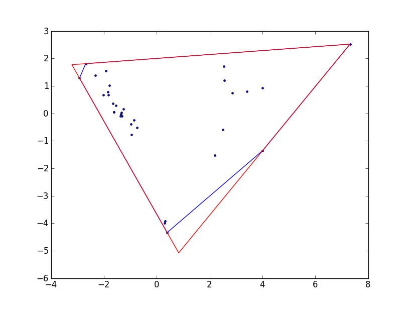

```{r setup, include=FALSE}
knitr::opts_chunk$set(fig.height = 10, fig.width = 15)
```

## Highlights


* We show high interpecfic variation in network parameters of fungi which partly correlates with taxonomy
* We advocate the use of network properties as functional traits for fungal ecology.
* We show that network parameters reveal the trait space in mycelium architecture across species

## Introduction

The body of most fungal species consists of an interconnected network filaments, yet fungal ecologists rarely use features of this network as fungal functional traits. We think not using network properties represents a missed opportunity because it is likely that the ecological success of fungi on land is partly due to such network growth  (Moore, D et al 2011). Indeed, such network body has become a signature feature through the diversification of this kingdom (already present in basal clades (Stajich, J E et al 2009)) which showcase its versatility in response to ecological interactions. In this paper, we lay the foundation to gain understanding on the ecologcical significance of network properties in fungi by identifying traits  encapsulates the network-structure of fungi, measure their variation and link them possible ecological strategies. 

We specifically identify traits that take into account the connection arrangement pattern of filaments once the mycelium is translateted into network graph (i.e. a set of nodes connected through edges Barthelemy 200X). In addition, the traits are further use recent biophysical models of transport dynamics of nutrients and information within the myceliy when fungi are exploring for resources (Luke and Mark paper). During such an exploration phase, fungi transport resources located from a source (like a resource patch or spore reserves) to subsidize hyphal tip extension and branching (ref). Because of the extremely patchy distribution of resources in their soil habitat, we think it is very likely that fungi will be in exploration phase for most of their life time. Thus, we consider that the traits we identify have a solid biological basis rooted in fungal anatomy and ecologically relevant scenarios. 

Second, we determine the degree of interspecific variation in network traits and whether it is related to phylogenetic affiliation across a diverse set of soil borne saprotrophic fungi. We included species in the Ascomycota, Basidiomycota and zygomycetous fungi (Mortierellomycota and Mucoromycota) and measured their network traits at both the micrometer and  macro (centimeter) scale. Doing so is imporant because fungi produce networks at both scales. For example, zygoymecetous and ascomycte soil fungi typically prouced mycelial networks composed of interconnected individual hyphae that span micrometer to milimiter scales through the soil (ref). In contrast, wood-decomposing basidiomycetes can produce networks consisting of cords (that results the fusion of several hyphae) that reach several centimeter in scale (ref).

Finally, we use the network traits to identify potential ecological strategies associated to differnces in transport through the connected pattern arregement of mycelia. To do this, we first determine how different the observed network properties are in comparison to a baseline network models that follow simple rules of minimized connectivity while maximizing transport. Thus, fungal networks closer to this model indicate a strategy that maximizes transport efficiency, while networks departing from it indicate fungi that increase the number of connections. Finally, we identify mycelial network that represent extreme phenotypes (or archetypal phenotypes) in the network trait morphospace (Alon´s paper) based on the differences in network properties. These archetypes represent extreme points in the realized mycelium morphospace.

What is the ecological meaning of these traits? 

Also, while you give the taxonomy of the fungi, we know little of their ecology or why these particular ones were used. What is their ecology, why were they chosen, and can their ecology throw light on their characters. 

From Fig. 2, it looks like some have three patterns – saturate the space (phalanx strategy – blue and orange), disperse and then saturate (guerrilla), and establish a base, and then explore (the consolidate and then explore); is this related to their ecology. Are these visual patterns identifiable in the network statistics, or should they be (do the network statistics change from center to edge….?)."


Things I want to add: How this might be useful to allometry; and the comments from Janis:

"In this study the big negative is that you have measured Basidio traits differently from the others, and I just cannot see how you can put them into the same analysis. Also, isn’t the measure of hyphal width/length different for a 20cm diameter mycelium on wood, where the hyphae form “compound strands” (I forget their technical name – rhizomorphs or something) of smaller hyphae? Surely it would be better to show that the analysis is applicable at different scales – one the micro, and the other the macro, using separate analyses.

Secondly, I think you need to do much more to explain how and why these network traits may have biological meaning. It is clear for some, but for others it seems just like calculating them “just because we can”, and their interpretation for biology needs to be explained.

Also, while you give the taxonomy of the fungi, we know little of their ecology or why these particular ones were used. What is their ecology, why were they chosen, and can their ecology throw light on their characters. From Fig. 2, it looks like some have three patterns – saturate the space (phalanx strategy – blue and orange), disperse and then saturate (guerrilla), and establish a base, and then explore (the consolidate and then explore); is this related to their ecology. Are these visual patterns identifiable in the network statistics, or should they be (do the network statistics change from center to edge….?)."

 

Reading some of the large clonal plant literature might be useful, and should be referred to, if only to broaden the relevance of the paper for readers.

## Material and methods

## Fungal species

We used 11 fungi belogning to zygomycetous groups, Ascomycota and Basidiomycota (EXPAND MORE)


### Microphotography and image processing

For ascomycete, mucoromycete, and mortierellomycete fungi, we extracted network parameters from pictures of 10-to-14 hours-old, 2mm-diameter fungal mycelium growing on water agar (the mycelium was growing out of an agar plug to which 10ul 10% PDB were added). Pictures were taken under a stereoscope (AxioZoom). For basidiomycete fungi, pictures were taken of 20-cm-diameter fungal mycelium growing on a wooden block on inert sand [To be added: picture settings, age of the mycelia]. Thus, although the pictures come from different sizes and settings, both conditions reflect the exploration phase of the mycelium. Each fungal species was replicated three times.

Then we used a bundle of image processing algorithms to segment the images, determine the connected patterns among hyphae (i.e. which hypha is connected to which), and estimate hyphal traits such as widths (these algorithms are wrapped in the MatLab App “Fungal Networks” developed by Mark Fricker). This information was then stored in two matrices: an “edge list” containing a list of all pairs of nodes (i.e. hyphae) and the traits of the hyphae. The second matrix contains the position of the nodes in x, y coordinates.


### Graph network representation

The outputs from the image-processing step were used to translate each mycelium picture into “spatially explicit weighted graph network” (Fig 1), where:

 + Nodes represent hyphal tips, branching points, and anastomosis points. These three node types are distinguished based on the amount of nodes they are connected from/to (that is, the degree of the node). For example, hyphal tips have degree = 1, as they connect only to one other node, while branching points have degree = 2 because they connect to two other “daughter” nodes.
+ Edges (links) represent the hyphae. These are defined as links connecting two nodes.
+ Edge attributes represent hyphal traits (such as length and width)
+ Edge weight represents the transport resistance of the hyphae (see explanation below).


### Calculation of mycelial traits

From the network graph we calculated 12 traits for each fungal colony (see table 1 for details). Five of those traits we classified as “descriptive,” representing direct average measurements of hyphal traits (edge attributes) that are not directly related to the connected arrangement of hyphae. The other traits, which are directly dependent on the connectedness arrangement, we refer to as “network traits” and include:

+ Normalized coefficients that illustrate deviations of an observed metric (e.g. number of nodes or links) from a (hypothetical) fully connected network (where all nodes are linked to each other). These coefficients are taken from transportation geography (Fricker et al. X);

+ Transport efficiencies, which summarize the efficiency of transporting material throughout the network following the assumptions of the “Hydraulic Hyphal transport Model.” Under this model, connected hyphae are idealized as a series of interconnected cylindrical pipes in which fluids move from the center of the colony (the inoculum agar or wooden plug, in our case) to each tip due to a difference in hydraulic pressure (citation). A fundamental metric of this model and in the “efficiency” metrics is the calculation of “hyphal transport resistance” based on hyphal lengths and widths (where the longer and thinner the hypha is, the higher the resistance) and “path hydraulic accessibility,” which is obtained as the minimal sum of hyphal resistances connecting two nodes . In turn, “efficiencies” represent mycelium-wide means based on such metrics (see table 1 for further details).

+ Minimum Spanning Tree (MST) ratios: These metrics represent deviations of the observed traits (like mean hyphal length) from a baseline network that preserves the number of nodes but reduces the edges to only include the ones that maximize transport efficiencies. The baseline model corresponds to “resistance-weighted minimum spanning tree.” In this model all nodes are connected through hyphal paths with minimal resistance. As a result, this baseline model does not contain any loops (see table 1 and Figure 2 for further details).

Table 1.

1. Mycelium descriptive traits

+ Mean hyphal length. This corresponds to the mean of each hyphal length in the network (defined as the measured distance between two nodes during the image processing). Given that the distribution of these lengths was left-skewed, this mean actually corresponds to log10 transformed lengths.

+ Total number of hyphae. The number of hyphae recorded for each network.

+ Mean tip hyphal width. Tip hyphae are defined as hyphae connecting a hyphal tip node (which is identified as a node degree = 1).Given that the distribution of these lengths was left-skewed, this mean actually corresponds to log10 transformed widths.

+ Mean main hyphal width. Main hyphae were defined as hyphae connecting branching or anastomosis nodes. Given that the distribution of these lengths was left-skewed, this mean actually corresponds to log10 transformed widths.

+ Hyphal density. This corresponds to the number of hyphae in a given area

+ Angle (O_min_mid). Not transformed [MORE EXPLANATION WILL BE ADDED].

2. Mycelium Network traits

+ Alpha coefficient. Proportion of cycles out of the total number of possible cycles given a certain number of nodes.

+ Beta coefficient. The ratio of edges and nodes.

+ Gamma coefficient. The proportion of edges out the total number of possible edges given a certain number of nodes.

+ Root-tip efficiency (R-Teff). The mean transport efficiency from the inoculum to each tip. To calculate this mean, first the paths that result in the lowest summations of resistances connecting the inoculum to each tip node are identified. That is, the paths with the highest hydraulic accessibility are identified (using the Dijkstra algorithm). Root-tip efficiency is then calculated as the mean of the sums of the inverse of resistances for all identified paths.

+ Root efficiency (Reff). The mean transport efficiency from the inoculum to each node is calculated as described above, but includes not only paths from inoculum to tips, but also to each node.

+ Global efficiency (Geff). The mean transport efficiency between any two nodes. It is similar to the root efficiency, but includes all paths connecting two nodes (not only the ones rooted to the inoculum).

+ Length-MST. The ratio of the mean hyphal length of the observed mycelium with respect to a baseline network with the same number of nodes, but that maximizes transport efficiency.

+ Geff-MST. The ratio of the Global efficiency of the observed network to that of the baseline network (as described above, the “resistance weighted minimum spanning tree”).

+ Descriptive traits were calculated during the image processing (using the MatLab App), while network traits were computed using the igraph package for R.


```{r,echo=FALSE,warning=FALSE}
source_rmd <- function(file, local = FALSE, ...){
  options(knitr.duplicate.label = 'allow')
  tempR <- tempfile(tmpdir = ".", fileext = ".R")
  on.exit(unlink(tempR))
  knitr::purl(file, output=tempR, quiet = TRUE)
  envir <- globalenv()
  source(tempR, local = envir, ...)
}

source_rmd("Assembling_Network_Trait_Data.Rmd")
```

```{r, echo=FALSE, warning=FALSE, message=FALSE}
library(igraph)
par(mfrow=c(2,4), mar=c(0,0,0,0)) 

plot(colonies_ntwk[[1]],
     edge.arrow.size=1,edge.curved=0,edge.width=2,
     vertex.label=NA,vertex.shape="none",
     edge.color="cyan",
     edge.size=150,vertex.size=0,layout=spatial.data[[1]]*1,main="Mortierella elongata Real Network")

plot(colonies_ntwk[[16]],
     edge.arrow.size=1,edge.curved=0,edge.width=2,
     vertex.label=NA,vertex.shape="none",
     edge.color="magenta",
     edge.size=150,vertex.size=0,layout=spatial.data[[16]]*1,main="Mucor fragilis Real Network")

plot(colonies_ntwk[[5]],
     edge.arrow.size=1,edge.curved=0,edge.width=2,
     vertex.label=NA,vertex.shape="none",
     edge.color="orange",
     edge.size=150,vertex.size=0,layout=spatial.data[[5]]*1,main="Fusarium redolens Real network")

plot(colonies_ntwk[[30]],
     edge.arrow.size=1,edge.curved=0,edge.width=2,
     vertex.label=NA,vertex.shape="none",
     edge.color="green",
     edge.size=150,vertex.size=0,layout=spatial.data[[30]]*1,main="Resinisium bicolor- Real network")

plot(Access_mst[[1]],
     edge.arrow.size=1,edge.curved=0,edge.width=2,
     vertex.label=NA,vertex.shape="none",
     edge.color="cyan",
     edge.size=150,vertex.size=0,layout=spatial.data[[1]]*1,main="Mortierella elongata- Baseline network")

plot(Access_mst[[16]],
     edge.arrow.size=1,edge.curved=0,edge.width=2,
     vertex.label=NA,vertex.shape="none",
     edge.color="magenta",
     edge.size=150,vertex.size=0,layout=spatial.data[[16]]*1,main="Mucor fragilis- Baseline network")

plot(Access_mst[[5]],
     edge.arrow.size=1,edge.curved=0,edge.width=2,
     vertex.label=NA,vertex.shape="none",
     edge.color="orange",
     edge.size=150,vertex.size=0,layout=spatial.data[[5]]*1,main="Fusarium redolens- Baseline network")


plot(Access_mst[[30]],
     edge.arrow.size=1,edge.curved=0,edge.width=2,
     vertex.label=NA,vertex.shape="none",
     edge.color="green",
     edge.size=150,vertex.size=0,layout=spatial.data[[30]]*1,main="Resinisium bicolor- Baseline network")

```

Figure 2. Examples of representation of fungal mycelium as network graphs. Top: Graph based on the observed mycelium. Bottom: Graph based on baseline model for each corresponding colony. Cyan: Mortierellomycota; Magenta: Mucor; Orange: Ascomycete; Green: Basidiomycota.

### Statistical analysis

We performed redundancy analysis (RDA, a type-constrained multivariate ordination) in order to identify interspecific differences in terms of  mycelial traits. We used both descriptive and network traits as the response variables and species identity as explanatory (constraining) variables. Prior to RDA, we standardized all variables in units of standard deviations (Z scaling). By doing this, we are effectively removing obvious differences among species due to absolute size differences. Because we also are interested in determining to what extent interspecific differences in mycelial traits correlate with phylogeny, our RDA model included phylum affiliation as a condition (thus the full RDA model was in the form Mycelial traits ~ Species identity + Condition (Phylum)). To determine to what extent the variance explained by constrained ordination deviates from a random distribution, we repeated RDA as above after randomizing the mycelial traits dataset (999x times in total) and computed F values and associated p-values (i.e. statistical significance). Standardizations, RDA, and significance testing from randomized approach were performed using the functions “rda” and “anova.cca” in the R package vegan.

Finally, we also identified mycelial archetypes as described in Alon et al. (200X). This technique consists of identifying the vertices from the best-fitting convex hull that includes all data points in the ordination space. To determine how likely these archetypes are from a random distribution, we repeated this calculation after randomizing the dataset (for a total of X randomizations). Archetype identification and randomizations were performed in the open-access Uri Alon software.
 (http://www.weizmann.ac.il/mcb/UriAlon/download/pareto-front-software).


## Results

*Separation of species based on mycelial traits*

We found support for the hypotheses that species differ in their network traits. For example, The observed constrained ordination, which includes species identity as explanatory variable, explains more variation than unconstrained one (87% vs  13%) and it significantly deviated from a permutation-based random distribution (999 randomizations) (table 2).

Table 2.
```{r,echo=FALSE, warning=FALSE,message=FALSE}
library(vegan)

Model_network_traits_sps_scaled<-rda(all_data_scaled[,                                        
                                  c("Hyphal_length","Hyphal_number","Hyphal_tip_width",
                                     "Hyphal_main_width",#"Hyphal_tip_access",
                                    "Hyphal_angle",
                                     "Mycelia_length_scaled","alpha_coeff","beta_coeff",
                                     "Root_eff","Reff_tip","Geff_scaled",
                                     "Mycelial_area","Hyphal_density" )]~Species + Condition(phylum),scale = TRUE,data = all_data_scaled)

Model_network_traits_sps_scaled_2<-rda(all_data_scaled[,                                        
                                  c("Hyphal_length","Hyphal_number","Hyphal_tip_width",
                                     "Hyphal_main_width",#"Hyphal_tip_access",
                                    "Hyphal_angle",
                                     "Mycelia_length_scaled","alpha_coeff","beta_coeff",
                                     "Root_eff","Reff_tip","Geff_scaled",
                                     "Mycelial_area","Hyphal_density" )]~Species, scale = TRUE,data = all_data_scaled)

Model_network_traits_sps_scaled
```

Table 3. 
```{r, echo=FALSE}
anova.cca(Model_network_traits_sps_scaled,by="term")
```
This strong effect can be easily visualized in constrained ordination space (Figure 3).

```{r, echo=FALSE, eval=FALSE}
RsquareAdj(Model_network_traits_sps_scaled)$adj.r.squared#This the adjusted r squared to the number of variables, the more variables the smaller the r square gets.

RsquareAdj(Model_network_traits_sps_scaled)$r.squared#This one corresponds to the value above
```


```{r,echo=FALSE, eval=FALSE}
summary(Model_network_traits_sps_scaled)[["cont"]][["importance"]][,c(1:2)]
summary(Model_network_traits_sps_scaled_2)[["cont"]][["importance"]][,c(1:2)]
```

```{r, echo=FALSE}

#Adding the two RDA axis to the dataframe
temporal<-as.data.frame(scores(Model_network_traits_sps_scaled,display = "sites",scaling = "species",choices=c(1,2)))

all_data_scaled1<-cbind(all_data_scaled,temporal);rm(temporal)

#Extracting the "site" or variable scores.
e_vectors_traits_scaled<-as.data.frame(
  scores(Model_network_traits_sps_scaled,display = "species",choices = c(1,2),scaling = "species"));
e_vectors_traits_scaled$traits<-rownames(e_vectors_traits_scaled)

names(e_vectors_traits_scaled)[1]<-"RDA1_species"
names(e_vectors_traits_scaled)[2]<-"RDA2_species"

#
my_theme<-
  theme(title = element_text(size = 18),
        axis.title.x=element_text(size=29),
        panel.background = element_blank(),
        panel.grid.major.x = element_line(size=0.25,linetype = "longdash",colour = "gray"),
        panel.grid.major.y = element_line(size=0.25,linetype = "longdash",colour = "gray"),
        #axis.text.x = element_text(size = 20,angle = 45,hjust = 1),
        axis.text.x = element_text(size = 15),
        axis.text.y = element_text(size = 15),
        strip.text.x = element_text(size = 20),
        strip.text.y = element_text(size = 25)#,
        #legend.position = "none"
        )

#
all_data_scaled1%>% 
  ggplot()+
  aes(x=RDA1,y=RDA2) +
  #geom_point(size=2)+
    geom_text(aes(color=phylum,label=Species)) +
    labs(y="RDA2 11%",x="RDA1 56%")+
  
  geom_text(size=2,aes(x=RDA1_species,y=RDA2_species,label=traits,fontface="bold"),
            hjust = 1.1, vjust =-0.5,#segment.size = 0,segment.color = 'transparent',
            data = e_vectors_traits_scaled)+
  geom_segment(aes(x=0, y=0, xend=RDA1_species, yend=RDA2_species), 
        arrow = arrow(),data = e_vectors_traits_scaled)+
  ggtitle(label = "Taxonomy corrected")+
  
    my_theme
```

```{r, echo=FALSE}

#Adding the two RDA axis to the dataframe
temporal<-as.data.frame(scores(Model_network_traits_sps_scaled_2,display = "sites",scaling = "species",choices=c(1,2)))

all_data_scaled2<-cbind(all_data_scaled,temporal);rm(temporal)

#Extracting the "site" or variable scores.
e_vectors_traits_scaled<-as.data.frame(
  scores(Model_network_traits_sps_scaled_2,display = "species",choices = c(1,2),scaling = "species"));
e_vectors_traits_scaled$traits<-rownames(e_vectors_traits_scaled)

names(e_vectors_traits_scaled)[1]<-"RDA1_species"
names(e_vectors_traits_scaled)[2]<-"RDA2_species"

#
all_data_scaled2 %>% 
  ggplot()+
  aes(x=RDA1,y=RDA2) +
  #geom_point(size=2)+
    geom_text(aes(color=phylum,label=Species)) +
    labs(y="RDA2 27%",x="RDA1 45%")+
  
  geom_text(size=2,aes(x=RDA1_species,y=RDA2_species,label=traits,fontface="bold"),
            hjust = 1.1, vjust =-0.5,#segment.size = 0,segment.color = 'transparent',
            data = e_vectors_traits_scaled)+
  geom_segment(aes(x=0, y=0, xend=RDA1_species, yend=RDA2_species), 
        arrow = arrow(),data = e_vectors_traits_scaled)+
  ggtitle(label = "No taxonomy correction")+
  
    my_theme
```

Figure 3. Constrained (RDA) ordination based on mycelial trait. Each name corresponds to one colony and colors refers to phylum. Upper panel shows ordination based on mycelial traits after taking into account phylogeny affiliation (i.e. correcting for taxonomy), while the bottom panel shows uncorrected ordination.

We also found that the species ordination was partly correlated with taxonomy (half of the variation explained in constrained ordination can be attributed to taxonomic affiliation) (Table 2).
Finally, the ordination was largely driven by network-traits contribution and not only by hyphal traits. For example, the loadings of the alpha coefficient, beta coefficient, scaled Global efficiency, and the scaled mycelial length had some of the highest loadings (scaled eigenvectors) for the first RDA axis, while both root-tip and root efficiency had large loadings for the second axis.
 
```{r,echo=FALSE,message=FALSE,warning=FALSE}
e_vectors_traits_scaled$type<-NA
e_vectors_traits_scaled$type[grep("Hyphal",e_vectors_traits_scaled$traits)]<-"Descriptive"
e_vectors_traits_scaled$type[which(e_vectors_traits_scaled$traits=="Mycelial_area")]<-"Descriptive"
e_vectors_traits_scaled$type[which(is.na(e_vectors_traits_scaled$type))]<-"Network"

pivot_longer(e_vectors_traits_scaled,RDA1_species:RDA2_species,names_to = "Axis",values_to="loading") %>% 
    ggplot()+
  aes(x=traits,y=abs(loading),fill=type)+
    geom_bar(stat="identity",position = "dodge")+
  facet_wrap(.~Axis)+
  labs(y="Loadings")+
  theme(title = element_text(size = 18),
        axis.title.x=element_text(size=20),
        panel.background = element_blank(),
        panel.grid.major.y = element_line(size=0.25,linetype = "longdash",colour = "gray"),
        panel.grid.major.x = element_blank(),
        axis.text.x = element_text(size = 15,angle = 45,hjust = 1),
        #axis.text.x = element_text(size = 15),
        axis.text.y = element_text(size = 15),
        strip.text.x = element_text(size = 20),
        strip.text.y = element_text(size = 25),
        legend.position = "bottom"
        )
```

Figure 4. Loadings (eigenvectors) of different mycelial traits for the first two mains RDA axis (that jointly explain up to 75% of the data)-


*Archetype identification*

Based on the species included, we found three achetypes in the mycelial trait morphospace [Expand more]. 




```{r, eval=FALSE,echo=FALSE,warning=FALSE,message=FALSE}
#This is done thrrough the Uri Alon´s softawer, thus I need to export the data and then use the software
all_data_t<-all_data[which(all_data$Network=="Real"),
                     c("Hyphal_length","Hyphal_number","Hyphal_tip_width",
                       "Hyphal_main_width","alpha_coeff","beta_coeff","Root_eff","Reff_tip","Geff","Hyphal_density","Mycelial_area")]

all_data_t<-sapply(all_data_t,function(x){(x-mean(x))/sd(x)})

write.csv2(all_data_t,"alldata_forTriangularity0.csv",row.names = F, col.names = F)
write.csv(all_data_t,"alldata_forTriangularity.csv",row.names = F, col.names = F)#This one can be read in my laptop
rm(all_data_t)
```


## Discussion

Other network traits that do not work but one would expect to be asked about
Connection with other type of networks (xylem networks)
How to expand on the network front (dual graph)
Is this a scalable pipeline
How is this work linked to other morphological traits with potetial ecological value: fruiting body traits. vegetatitive mycelia (qualitative ones); up to more recent is 

Note: there is paper by Anne Pringle about the morphospace for fungi. My papers.

Our work introduces a new set of quantitative parameters that can be used to understand and compare the ecology of fungal species, thus expanding the limited set of phenotypic fungal characteristics that can be used as functional traits. So far most phenotypic traits used in ecological literature have been restricted to easy measures of reproductive structures like fruiting bodies or spore characteristics (ref). While valuable to understand the reproductive and early ecology of fungi (Aguilar-Trigueros et al 2019. other ref), there are considerable less attention to phentypic characteriscs of the vegetative phase, which in comparison to the reproductive one, is the predominant one in the lifetime of fungi.

Thus, our work goes one step further in understanding the ecology of the vegetative phase of fungi by focusing on network properties (i.e. properties that emerge from connectedness patterns mycelia) . Historically, vegetative mycelial phenotypes have been described using caterogies like "guerrilla" and "phalynx" strategies (borrowed from the work on clonal plants (ref)), or exploration types (Agerer 2001). The use of quantitative metrics of mycelial features has picked up not until recently after numerous calls for their need ecology (my paper, Tresseder, Crowther). For example, to identify potential resource aquisition strategies Lehmann et al (200X) relied on hyphal traits (e.g. branching, extension rate and lenght) of soil fungi while Boddy et al (200X) while Boddy et al (200X) used "space filling" (e.g. fractal dimension) for wood deomposing fungi . Yet, to our knoledge, connected arrengment of the mycelia has not been included. Even Dicke et al (2020), that while not an ecological study did represent fungi as a network graph, restrict their analysis to descriptive parameters such as number of nodes and links. 

The network traits allow us to identify potential strategies.

Looking into the future, we think that using the network framework leads to a fruitful researh prospect. Dual graphs, comparisons to other transport networks like plant vascular tissue (xylem, leaf vains)


wresults showed that: a) species differ in terms of mycelial traits; b) such variation reflects to large extent phylogey and c) a large proportion of the difference among species is due to netowrk connectedeness pattern and not only due to hyphal descriptive traits. 


[From Janis] saturate the space (phalanx strategy – blue and orange), disperse and then saturate (guerrilla), and establish a base, and then explore (the consolidate and then explore); is this related to their ecology. Are these visual patterns identifiable in the network statistics, or should they be (do the network statistics change from center to edge….?)."


In addition, the network model we used (and its metrics) emphasize the dynamic nature of fungal mycelia as connected trasnport network (Fricker et al 200x) during exploration phase. This is phase has been understudied in comparison to resource explotation phase (that is, when fungi grow on resource rich substrate). This is paradoxical, because exploration phase is is likely the dominant phenotype due to extremely patchy distrbution of resources where most fungi grow (e.g. soil). 

Metrics we used, like  efficiency, could be used to predict the transport of resources from the center of the colony to every point of the expanding mycelium. Such differences would be extremely useful to understand the ecological ecological strategies among fungal species during competition or fungivory. For example, a mycelium network consisting mostly of thick "roads" allows for faster transfer of resources to expanding front, a strategy useful to: occupy find new resource patchs before competitors; synthetize chemical compounds to combat other competitors at the hyphal front or reduce palatability in face of fungivory. On the other hand, due to the reliance on few main roads, these networks would be very suscepible to loose connectivity due to manage (which can be caused by fungivory or catastrophic events).

[HERE DISCUSSSION ON MEANING OF THE ARCHETYPES]

What about othe network properties? why are they not used?

We consider that our work as a blueprint for future research on the ecological and evoluationary meaning of network connectedness traits in three main ways. First, by including more species spanning a better resolution in phylogenetic resolution. It is premature to make conclusive remarks on this point based on limited number of species we used, but it indicates that a larege proportion of differences in mycelial traits is due to taxomy.  Thus, larger species pool would allow to uncover not only the real diversity of network traits but also determine to what extent such diversity is due to few early evolutionary events that have been preserved among extant taxa (high phylogenetic conservatisms) or whether differences among species arise due to ecological pressures multiple and independent times through fungal evoution (low phylogenetic consevartism) using state-of-the art phylogenetic comparative anylytical tools. Second, by including intraspecific variation driven by plasticity and within species genetic variation. We only a limited set of conditions on which we measured mycelial tratis. Such work should be used using standardized protocols so that comparisions among species are straightforward. Third, include 3D scenarios. In this study we force the fungi to grow on 2 dimensions and thus network reprsentation is strictly speaking 2D. In reality fungal networks are 3D and thus, representing this dimension not only would increase the precision of our metrics, but could also reveal different emergent properties not observable as 3D. 


## Supplementary material

Previous models

```{r,eval=FALSE}
#This one is optional
Model_network_traits_sps<-rda(all_data[which(all_data$Network=="Real"),
                                       c("Hyphal_length","Hyphal_number","Hyphal_tip_width",
                                     "Hyphal_main_width","Hyphal_tip_access","Hyphal_angle",
                                     "Mycelia_length","alpha_coeff","beta_coeff",
                                     "Root_eff","Reff_tip","Geff",
                                     "Mycelial_area","Hyphal_density" )]~Species,scale = TRUE,data = all_data[which(all_data$Network=="Real"),])


#
temporal2<-as.data.frame(scores(Model_network_traits_sps,display = "sites",scaling = "species",choices=c(1,2)))

sps_data<-cbind(all_data[which(all_data$Network=="Real"),],temporal2);rm(temporal2)
sps_data$phylum<-NA
sps_data$phylum[grep("DF9|C41|FOX|DF32",sps_data$name_col)]<-"Ascomycota"
sps_data$phylum[grep("C34|C35|DF19|DF25|DF56|M",sps_data$name_col)]<-"Zygomycetous"
sps_data$phylum[grep("Pi|Pv|Rb",sps_data$name_col)]<-"Basidiomycota"

#
e_vectors_traits_sps<-as.data.frame(
  scores(Model_network_traits_sps,display = "species",choices = c(1,2),scaling ="species"));
names(e_vectors_traits_sps)<-c("RDA1_species","RDA2_species")


# temporal<-as.data.frame(
#   scores(Model_network_traits_sps,display = "species",choices = c(1,2),scaling = "species"));names(temporal)<-c("RDA1_species","RDA2_species")

#e_vectors_traits<-cbind(e_vectors_traits,temporal)
e_vectors_traits_sps$traits<-rownames(e_vectors_traits_sps)
#
sps_data %>% 
  ggplot()+
  aes(x=RDA1,y=RDA2) +
  #geom_point(size=2)+
    geom_text(aes(color=phylum,label=Species)) +
  #scale_color_viridis_d()+
  labs(y="RDA2 24%",x="RDA1 43%")+
  
    
  geom_text(size=2,aes(x=RDA1_species,y=RDA2_species,label=traits,fontface="bold"),
            hjust = 1.1, vjust =-0.5,#segment.size = 0,segment.color = 'transparent',
            data = e_vectors_traits_sps)+
  geom_segment(aes(x=0, y=0, xend=RDA1_species, yend=RDA2_species), 
        arrow = arrow(),data = e_vectors_traits_sps)+
  my_theme
```


```{r, echo=FALSE, eval=FALSE}
#How much each variable contributes to the axis
e_vectors_traits_sps %>% 
  select(RDA1_species,RDA2_species,traits) %>% 
  pivot_longer(RDA1_species:RDA2_species, names_to="Principal_axes",values_to="loading") %>% 
  ggplot()+
  aes(x=traits,y=abs(loading),fill=Principal_axes)+
    geom_bar(stat="identity",position = "dodge")+
  labs(y="Loadings")+
  theme(axis.text.x = element_text(size=8,angle = 45,hjust = 1),
        legend.position = "bottom")
    
```


```{r, eval=FALSE, message=FALSE, warning=FALSE}

Model_network_traits<-rda(all_data[,c("Hyphal_length","Hyphal_number","Hyphal_tip_width",
                                     "Hyphal_main_width","Hyphal_tip_access","Hyphal_angle",
                                     "Mycelia_length","alpha_coeff","beta_coeff",
                                     "Root_eff","Reff_tip","Geff",
                                     "Mycelial_area","Hyphal_density" )]~Species+Network,scale = TRUE,data = all_data)
#
Model_network_traits

summary(Model_network_traits)[["cont"]][["importance"]][,c(1:2)]

anova.cca(Model_network_traits,by="term")
#

#Making the plot
temporal<-as.data.frame(scores(Model_network_traits,display = "sites",scaling = "species",choices=c(1,2)))

all_data_ord<-cbind(all_data,temporal);rm(temporal)

e_vectors_traits<-as.data.frame(
  scores(Model_network_traits,display = "species",choices = c(1,2),scaling = "species"));
e_vectors_traits$traits<-rownames(e_vectors_traits)

names(e_vectors_traits)[1]<-"RDA1_species"
names(e_vectors_traits)[2]<-"RDA2_species"

#

all_data_ord %>% 
  ggplot()+
  aes(x=RDA1,y=RDA2) +
  #geom_point(size=2)+
    geom_text(aes(color=Network,label=Species)) +
    labs(y="RDA2 28%",x="RDA1 37%")+
  
  geom_text(size=2,aes(x=RDA1_species,y=RDA2_species,label=traits,fontface="bold"),
            hjust = 1.1, vjust =-0.5,#segment.size = 0,segment.color = 'transparent',
            data = e_vectors_traits)+
  geom_segment(aes(x=0, y=0, xend=RDA1_species, yend=RDA2_species), 
        arrow = arrow(),data = e_vectors_traits)+
  
    my_theme
#rmarkdown::render("FungalNetworkDiversity.Rmd", quiet = T)
```
