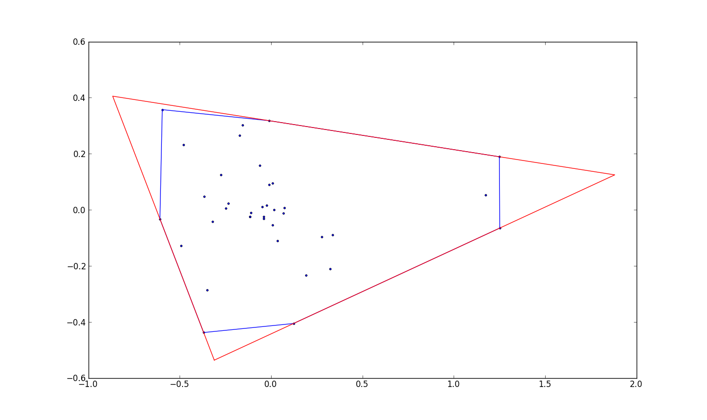

# Loading packages and data

This data correspond to the outputs after the executing ISMEJC_data_assembly.Rmd
```{r, echo = FALSE, warning = FALSE, message = FALSE}
#I save the objects to be used here as an RDS, thus it is not necessary to run the whole RMD above every time.
rm(list = ls())
library(tidyverse)
library(igraph)

colonies_ntwk <- readRDS("ISMEJ_C_output//colonies_ntwk.RDS")
Access_mst <- readRDS("ISMEJ_C_output//Access_mst.RDS")
all_data_scaled <- readRDS("ISMEJ_C_output//all_data_scaled.RDS")
all_data <- readRDS("ISMEJ_C_output//all_data.RDS")
robustness <- readRDS("ISMEJ_C_output//robustness.RDS")
spatial.data <- readRDS("ISMEJ_C_output//spatial.data.RDS")

#summary values from Mark
summaryTraits_Mark_AZB <- readRDS("ISMEJ_C_output//summaryTraits_Mark_AZB.RDS")
#summaryTraits_Mark_B<-readRDS("summaryTraits_Mark_B.RDS")

#All values as imported from the app
Edge_Traits <- readRDS("ISMEJ_C_output//Edge_Traits.RDS")
Node_Traits <- readRDS("ISMEJ_C_output//Node_Traits.RDS")

#Changing data formats and correcting typos


# Fixing typo entries
all_data_scaled$Mycelial_area[3] <- mean(c(30.56246,29.87179))

all_data_scaled$Hyphal_density <- all_data_scaled$Hyphal_number/all_data_scaled$Mycelial_area

all_data_scaled$Length_density <- all_data_scaled$Mycelia_length/all_data_scaled$Mycelial_area

# Adding a new species code for later codes

all_data_scaled$easy_code<-NA
all_data_scaled$easy_code[all_data_scaled$Species=="Alternaria sp"]<-"Alt."
all_data_scaled$easy_code[all_data_scaled$Species=="Fusarium oxysporum"]<-"Fus.1"
all_data_scaled$easy_code[all_data_scaled$Species=="Fusarium redolens"]<-"Fus.2"
all_data_scaled$easy_code[all_data_scaled$Species=="Mortierella alpina"]<-"Mort.1"
all_data_scaled$easy_code[all_data_scaled$Species=="Mortierella alpina2"]<-"Mort.2"
all_data_scaled$easy_code[all_data_scaled$Species=="Mortierella elongata"]<-"Mort.3"
all_data_scaled$easy_code[all_data_scaled$Species=="Mortierella elongata2"]<-"Mort.4"
all_data_scaled$easy_code[all_data_scaled$Species=="Mucor fragilis"]<-"Muc."
all_data_scaled$easy_code[all_data_scaled$Species=="Umbelopsis isabellina"]<-"Umb."
all_data_scaled$easy_code[all_data_scaled$Species=="Resinicium bicolor"]<-"Res.b"
all_data_scaled$easy_code[all_data_scaled$Species=="Phanerachaete ventulina"]<-"Phan.v"
all_data_scaled$easy_code[all_data_scaled$Species=="Phallus impudicus"]<-"Phal.i"
#all_data_scaled$easy_code[all_data_scaled$Species=="Hypholoma fasiculare"]<-"H.f"

all_data_scaled<-left_join(all_data_scaled,robustness,by="name_col")

#Saving a copy of this dataframe that contains all data.
all_data_scaled_original <- all_data_scaled

# For Volume-MST, we actually used ratio of the total length of the real mycelia to the length of the MST mycelia
# the trait should have called Length-MST, but I keep this term for consistency with the ISMEJ C paper.

all_data_scaled$Mycelia_Vol_MST <- all_data_scaled$Mycelia_length_MST

# Changing the format of a table

library(tidyverse)
Edge_Traits<-bind_rows(Edge_Traits)

Edge_Traits$Species<-NA
Edge_Traits$Species[grep("C34",Edge_Traits$name)]<-"Mortierella sp.3"
Edge_Traits$Species[grep("C35",Edge_Traits$name)]<-"Umbelopsis sp"
Edge_Traits$Species[grep("DF19",Edge_Traits$name)]<-"Mortierella sp.1"
Edge_Traits$Species[grep("DF25",Edge_Traits$name)]<-"Mortierella sp.4"
Edge_Traits$Species[grep("DF56",Edge_Traits$name)]<-"Mucor sp"
Edge_Traits$Species[grep("M",Edge_Traits$name)]<-"Mortierella sp.2"

Edge_Traits$Species[grep("DF9",Edge_Traits$name)]<-"Alternaria sp"
Edge_Traits$Species[grep("C41",Edge_Traits$name)]<-"Fusarium sp.2"
Edge_Traits$Species[grep("FOX",Edge_Traits$name)]<-"Fusarium sp.1"


Edge_Traits$Species[grep("Pi",Edge_Traits$name)]<-"Phallus impudicus"
Edge_Traits$Species[grep("Pv",Edge_Traits$name)]<-"Phanerochaete velutina"
Edge_Traits$Species[grep("Rb",Edge_Traits$name)]<-"Resinicium bicolor"


#Assuming the Or_ij can be expressed from 0 to 360 degrees. However this is not the angle
#that Mark recommends. According to him, I should be using node_Omin_Omid located in the
#Node_Traits
Edge_Traits$Or_ij[which(Edge_Traits$Or_ij<0)]<-(Edge_Traits$Or_ij[which(Edge_Traits$Or_ij<0)]*-1)+180

Edge_Traits<-Edge_Traits[which(Edge_Traits$Type=="E"),]

Node_Traits<-bind_rows(Node_Traits)

Node_Traits$node_name_ID<-paste(Node_Traits$name,Node_Traits$node_ID,sep = "_")

Node_Traits$Species<-NA
Node_Traits$Species[grep("C34",Node_Traits$name)]<-"Mortierella elongata"
Node_Traits$Species[grep("C35",Node_Traits$name)]<-"Umbelopsis isabellina"
Node_Traits$Species[grep("DF19",Node_Traits$name)]<-"Mortierella alpina"
Node_Traits$Species[grep("DF25",Node_Traits$name)]<-"Mortierella elongata2"
Node_Traits$Species[grep("DF56",Node_Traits$name)]<-"Mucor fragilis"
Node_Traits$Species[grep("M",Node_Traits$name)]<-"Mortierella alpina2"

Node_Traits$Species[grep("DF9",Node_Traits$name)]<-"Alternaria sp"
Node_Traits$Species[grep("C41",Node_Traits$name)]<-"Fusarium redolens"
Node_Traits$Species[grep("FOX",Node_Traits$name)]<-"Fusarium oxysporum"
Node_Traits$Species[grep("DF32",Node_Traits$name)]<-"Fusarium solani"

Node_Traits$Species[grep("Pi",Node_Traits$name)]<-"Phallus impudicus"
Node_Traits$Species[grep("Pv",Node_Traits$name)]<-"Phanerochaete velutina"
Node_Traits$Species[grep("Rb",Node_Traits$name)]<-"Resinicium bicolor"

#For the first node
trial<-
left_join(Edge_Traits%>%
            mutate(node_name_ID=paste(name,EndNodes_1,sep = "_")),
          Node_Traits[,c("node_name_ID","node_Type","node_Degree")])

trial<-trial%>%
  rename(node_1_name_ID=node_name_ID)%>%
  rename(EndNodes_1_Type=node_Type)%>%
  rename(EndNodes_1_Degree=node_Degree)


#For the second node
trial<-
left_join(trial%>%
            mutate(node_name_ID=paste(name,EndNodes_2,sep = "_")),
          Node_Traits[,c("node_name_ID","node_Type","node_Degree")])

trial<-trial%>%
  rename(node_2_name_ID=node_name_ID)%>%
  rename(EndNodes_2_Type=node_Type)%>%
  rename(EndNodes_2_Degree=node_Degree)

Edge_Traits_o<-Edge_Traits
Edge_Traits<-trial;rm(trial)

Edge_Traits$phylum<-NA
Edge_Traits$phylum[grep("Pi|Pv|Rb",Edge_Traits$name)]<-"Basidiomycota"
Edge_Traits$phylum[grep("Mortierella|Mucor|Umbelopsis",Edge_Traits$Species)]<-"Ascomycota"
Edge_Traits$phylum[grep("Fusarium|Alternaria",Edge_Traits$Species)]<-"Zygomycetous"


Node_Traits$phylum<-NA
Node_Traits$phylum[grep("Pi|Pv|Rb",Node_Traits$name)]<-"Basidiomycota"
Node_Traits$phylum[grep("Mortierella|Mucor|Umbelopsis",Node_Traits$Species)]<-"Ascomycota"
Node_Traits$phylum[grep("Fusarium|Alternaria",Node_Traits$Species)]<-"Zygomycetous"

```


# Tables and data figures


Figure 3. Diversity of fungal mycelia translated into weighted planar graph representations.

Figure 3 of the ISMEJ Communications contains three elements: a) Camera pictures of mycelia; b) Graph translation of the figures (color coded); c) a scale bar of the color code.

By executing this code, one can reproduce each of the 12 graph tranlations depicted in Figure 3 of the ISMEJ Communications paper and the scale bar. Note: The pictures taken from the mycelia (taken with camera or microscope) that are also displayed in the figure are not included.

```{r, eval=FALSE}
#For this images I am using dimension 961 x 703 save as png images
library(scales)
library(igraph)
library(cetcolor)
# cet_pal(3,name = "cbl2")
# cet_pal(3,name = "d8")

#1. C34 C34(1)_t11 Mortierella sp.3
par(mar=c(0,0,0,0))
#ecol<-cscale(E(colonies_ntwk[[1]])$width,palette = div_gradient_pal(cet_pal(3,name="d7")))
ecol<-cscale(log10(E(colonies_ntwk[[1]])$width),palette = div_gradient_pal(cet_pal(3,name="cbd1")))
ecol<-cscale(log10(E(colonies_ntwk[[1]])$width),palette = div_gradient_pal(cet_pal(3,name="l9")))
ecol<-cscale(E(colonies_ntwk[[1]])$width,palette = div_gradient_pal(cet_pal(3,name="l9")))
#ecol<-cscale(log10(E(colonies_ntwk[[1]])$width),palette = seq_gradient_pal(cet_pal(2,name="l9")))
#ecol<-cscale(E(colonies_ntwk[[1]])$width,palette = div_gradient_pal(low = "#FDE725FF",mid = "#1F968BFF",high = "#440154FF"))
#ecol<-cscale(E(colonies_ntwk[[1]])$width,palette = seq_gradient_pal(low = "yellow",high = "red"))
ecol[E(colonies_ntwk[[1]])[type=="Inoculum"]]<-"bisque2"
plot(colonies_ntwk[[1]],
     edge.arrow.size=1,edge.curved=0,edge.width=2,
     vertex.label=NA,vertex.shape="none",
     edge.color=ecol,
     edge.size=150,vertex.size=0,layout=spatial.data[[1]]*1,main="Mortierella elongata")

#2.C35 C35(4)_t30 Umbelopsis isabellina
ecol<-cscale(E(colonies_ntwk[[4]])$width,palette = div_gradient_pal(low = "#FDE725FF",mid = "#1F968BFF",high = "#440154FF"))
#ecol<-cscale(E(colonies_ntwk[[4]])$width,palette = seq_gradient_pal(low = "yellow",high = "red"))
ecol[E(colonies_ntwk[[4]])[type=="Inoculum"]]<-"bisque2"
plot(colonies_ntwk[[4]],
     edge.arrow.size=1,edge.curved=0,edge.width=2,
     vertex.label=NA,vertex.shape="none",
     edge.color=ecol,
     edge.size=150,vertex.size=0,layout=spatial.data[[4]]*1,main="Umbelopsis isabellina")

#3. C41 Fusarium redolens "C41(1)_t25_c
#ecol<-cscale(E(colonies_ntwk[[5]])$width,palette = div_gradient_pal(low = "#FDE725FF",mid = "#1F968BFF",high = "#440154FF"))
ecol<-cscale(E(colonies_ntwk[[5]])$width,palette = div_gradient_pal(low = "#440154FF",mid = "orange",high ="darkred" ))
#ecol<-cscale(log10(E(colonies_ntwk[[5]])$width),palette = div_gradient_pal(low ="blue",mid="orange",high ="red"))
ecol[E(colonies_ntwk[[5]])[type=="Inoculum"]]<-"bisque2"
plot(colonies_ntwk[[5]],
     edge.arrow.size=1,edge.curved=0,edge.width=2,
     vertex.label=NA,vertex.shape="none",
     edge.color=ecol,
     edge.size=150,vertex.size=0,layout=spatial.data[[5]]*1,main="Fusarium redolens")

#4. DF19 "Mortierella sp1 DF19(1)_t11
ecol<-cscale(E(colonies_ntwk[[8]])$width,palette = div_gradient_pal(low = "#FDE725FF",mid = "#1F968BFF",high = "#440154FF"))
ecol[E(colonies_ntwk[[8]])[type=="Inoculum"]]<-"bisque2"
plot(colonies_ntwk[[8]],
     edge.arrow.size=1,edge.curved=0,edge.width=2,
     vertex.label=NA,vertex.shape="none",
     edge.color=ecol,
     edge.size=150,vertex.size=0,layout=spatial.data[[8]]*1,main="Mortierella alpina")

#5. DF25 Mortierella sp4 DF25(4)_t08 (position 11) or "DF25(6)_t11" (position 13)
ecol<-cscale(E(colonies_ntwk[[11]])$width,palette = div_gradient_pal(low = "#440154FF",mid = "#1F968BFF",high ="#FDE725FF" ))
ecol[E(colonies_ntwk[[11]])[type=="Inoculum"]]<-"bisque2"
plot(colonies_ntwk[[11]],
     edge.arrow.size=1,edge.curved=0,edge.width=2,
     vertex.label=NA,vertex.shape="none",
     edge.color=ecol,
     edge.size=150,vertex.size=0,layout=spatial.data[[11]]*1,main="Mortierella sp")

#6. DF56 Mucor fragilis "DF56(6)_t09
ecol<-E(colonies_ntwk[[16]])$width

ecol[E(colonies_ntwk[[16]])[type=="Inoculum"]]<-1

ecol2<-cscale(ecol,palette = seq_gradient_pal(low="#F7FBFF", high = "#08306B"))

# ecol<-cscale(E(colonies_ntwk[[16]])$width,palette = div_gradient_pal(low = "#FDE725FF",mid = "#1F968BFF",high = "#440154FF"))

ecol2[E(colonies_ntwk[[16]])[type=="Inoculum"]]<-"bisque2"


plot(colonies_ntwk[[16]],
     edge.arrow.size=1,edge.curved=0,
     #edge.width=2,
     edge.width=ecol/3,
     vertex.label=NA,vertex.shape="none",
     edge.color=ecol2,
     edge.size=150,vertex.size=0,layout=spatial.data[[16]]*1,main="Mucor fragilis")

#7. DF9 Alternaria sp "DF9(6)_t25_c
ecol<-cscale(E(colonies_ntwk[[19]])$width,palette = div_gradient_pal(low = "#FDE725FF",mid = "#1F968BFF",high = "#440154FF"))
ecol[E(colonies_ntwk[[19]])[type=="Inoculum"]]<-"bisque2"
plot(colonies_ntwk[[19]],
     edge.arrow.size=1,edge.curved=0,edge.width=2,
     vertex.label=NA,vertex.shape="none",
     edge.color=ecol,
     edge.size=150,vertex.size=0,layout=spatial.data[[19]]*1,main="Alternaria sp")

#8. FOX Fusarium oxysporum FOX(1)_t24_c
ecol<-cscale(E(colonies_ntwk[[20]])$width,palette = div_gradient_pal(low = "#FDE725FF",mid = "#1F968BFF",high = "#440154FF"))
ecol[E(colonies_ntwk[[20]])[type=="Inoculum"]]<-"bisque2"
plot(colonies_ntwk[[20]],
     edge.arrow.size=1,edge.curved=0,edge.width=2,
     vertex.label=NA,vertex.shape="none",
     edge.color=ecol,
     edge.size=150,vertex.size=0,layout=spatial.data[[20]]*1,main="Fusarium oxysporum")

#9. M  Mortierella sp.2 M(5)_t13_c
ecol<-cscale(E(colonies_ntwk[[22]])$width,palette = div_gradient_pal(low = "#440154FF",mid = "#1F968BFF",high ="#FDE725FF" ))
ecol<-cscale(E(colonies_ntwk[[22]])$width,palette = div_gradient_pal(low = "#440154FF",mid = "orange",high ="darkred" ))
ecol[E(colonies_ntwk[[22]])[type=="Inoculum"]]<-"bisque2"
plot(colonies_ntwk[[22]],
     edge.arrow.size=1,edge.curved=0,edge.width=2,
     vertex.label=NA,vertex.shape="none",
     edge.color=ecol,
     edge.size=150,vertex.size=0,layout=spatial.data[[22]]*1,main="Mortierella alpina2")

#10.Pi Phallus impudicus Pi 18C day 20 003
n<-49
ecol<-cscale(E(colonies_ntwk[[n]])$width,palette = div_gradient_pal(low = "#FDE725FF",mid = "#1F968BFF",high = "#440154FF"))
ecol[E(colonies_ntwk[[n]])[type=="Inoculum"]]<-"bisque2"
plot(colonies_ntwk[[n]],
     edge.arrow.size=1,edge.curved=0,edge.width=2,
     vertex.label=NA,vertex.shape="none",
     edge.color=ecol,
     edge.size=150,vertex.size=0,layout=spatial.data[[n]]*1,main="Phallus impudicus")

#11. Pv Phanerochaete velutina Pv_ctrl1_d8_1
#ecol<-cscale(E(colonies_ntwk[[27]])$width,palette = div_gradient_pal(low = "#FDE725FF",mid = "#1F968BFF",high = "#440154FF"))
ecol<-cscale(E(colonies_ntwk[[27]])$width,palette = div_gradient_pal(low = "#440154FF",mid = "orange",high ="darkred" ))
ecol[E(colonies_ntwk[[27]])[type=="Inoculum"]]<-"bisque2"
plot(colonies_ntwk[[27]],
     edge.arrow.size=1,edge.curved=0,edge.width=2,
     vertex.label=NA,vertex.shape="none",
     edge.color=ecol,
     edge.size=150,vertex.size=0,layout=spatial.data[[27]]*1,main="Phanerochaete velutina")

#12.Rb Resinicium bicolor, 
#Rb ctrl_d8_3
r<-which(all_data_scaled_original$name_col=="Rb_ctrl1_d8_3")
rb<-colonies_ntwk[[r]]
ecol<-E(rb)$width
ecol[E(rb)[type=="Inoculum"]]<-(quantile(ecol[E(rb)[type!="Inoculum"]])[2])/2
#ecol2<-cscale(ecol,palette = seq_gradient_pal(low="#F7FBFF", high = "#08306B"))
ecol2<-cscale(ecol,palette = div_gradient_pal(low = "#FDE725FF",mid = "#21908CFF",high = "#440154FF"))
ecol2[E(rb)[type=="Inoculum"]]<-"gray30"

#jpeg("Updated_Figures\\Rb_ctrl1_d8_3_for_triangle.jpg",width = 961,height = 703)
par(mar=c(0.5,0.5,0.5,0.5))
plot(rb,
     edge.arrow.size=1,edge.curved=0,
     edge.width=2,
     #edge.width=ecol/3,
     vertex.label=NA,vertex.shape="none",
     edge.color=ecol2,
     edge.size=150,vertex.size=0,layout=spatial.data[[r]]*1,
     main=unique(E(rb)$name))

#dev.off()

#Making a colorbar (scalebar) for the network graph figures above


library(scales)
escala<-
data.frame(z=colorRampPalette(c("#FDE725FF","#1F968BFF","#440154FF"))(100),
           y=c(1:100),
           x=rep(1,100))

plot(escala$x,escala$y,col=escala$z)

show_col(viridis_pal()(100),labels = FALSE,ncol = 1,borders = NA)

```


Figures 4 to 5. Tables 1 and 2

Figure 4 to 5 and tables 1 and 2 are based on the redundancy analysis (RDA) where the traits are the mycelial and network variables extracted from the graph representation of the fungal colonies. 

To reproduce them, first is necesary to execute the RDA
```{r,echo=FALSE, warning=FALSE,message=FALSE}
library(vegan)

variables<-
  c("Hyphal_length","Hyphal_tip_width","Hyphal_main_width",
    "Hyphal_angle","Length_density","alpha_coeff","Root_eff",
    "Reff_tip","Mycelia_Vol_MST","Geff_MST","des_length_robustness",
    "asc_width_robustness","des_width_robustness","random_robustness","spatial_robustness")


Ascos_zygos<-all_data_scaled[-which(all_data_scaled$phylum=="Basidiomycota"),]

#Ascos & Zygos
Model_Ascos_Zygos<-rda(Ascos_zygos[,variables]~Species+Condition(phylum),
                       scale = TRUE,data = Ascos_zygos)

#Basidios
Basidios<-all_data_scaled[which(all_data_scaled$phylum=="Basidiomycota"),]


Model_Basidios<-rda(Basidios[,variables]~Species ,scale = TRUE,data = Basidios)

#All data
#Here I decided to use only the traits that are scaled (this came actually later, after I checked that the triangularity would not make sense if I had variables that depedended on total size)

all_data_scaled_c<-all_data_scaled
all_data_scaled_c$Root_eff_a_scaled<-all_data_scaled_c$Root_eff/all_data_scaled_c$Mycelial_area
all_data_scaled_c$Reff_tip_a_scaled<-all_data_scaled_c$Reff_tip/all_data_scaled_c$Mycelial_area

scaled_variables<-c("alpha_coeff","Root_eff_a_scaled",
                  "Reff_tip_a_scaled","Mycelia_Vol_MST","Geff_MST","des_length_robustness",
                  "asc_width_robustness","des_width_robustness","random_robustness",
                  "spatial_robustness")

Model_network_traits_sps_scaled<-
  rda(all_data_scaled_c[,scaled_variables]~Species + Condition(phylum),
      scale = TRUE,data = all_data_scaled_c)

#rm(all_data_scaled_c)

#Adding some aesthetic parameters
my_theme<-
  theme(#title = element_text(size = 18),
        axis.title=element_text(size=20),
        panel.background = element_blank(),
        panel.grid.major.x = element_line(size=0.25,linetype = "longdash",colour = "gray"),
        panel.grid.major.y = element_line(size=0.25,linetype = "longdash",colour = "gray"),
        #axis.text.x = element_text(size = 20,angle = 45,hjust = 1),
        axis.text.x = element_text(size = 20),
        axis.text.y = element_text(size = 20),
        strip.text.x = element_text(size = 20),
        strip.text.y = element_text(size = 25),
        legend.position = "none"
        )
```


Table 1 Comparison of the proportion of explained variation in mycelial traits (both hyphal and network traits) between unconstrained ordination (equivalent to a PCA) and constrained ordination (RDA), in which species identity was the explanatory variable and, when applicable, Phylum identity as a conditional to control for phylogenetic relatedness.


```{r,echo=FALSE, warning=FALSE,message=FALSE}
#Basidiomycota

Model_Basidios

#Ascomycota
Model_Ascos_Zygos

#All together
Model_network_traits_sps_scaled
```

Table 2 Result from permutation-based statistical test for the three RDA models based on mycelial traits (both hyphal and network traits). The first model included only microscopic mycelia (zygomycetous and ascomycete fungi), while the second model included only macroscopic mycelia (basidiomycetes). The last model included all groups of fungi. In all cases, the RDA model follows the following form: Mycelial traits ~ Species identity, with Phylum identity as a conditional variable (i.e., covariate) when applicable. F- and p-values were based on 9999 permutations of the constrained ordination.

```{r}

#Basidiomycota
anova.cca(Model_Basidios,by="term",permutations = 9999)

# Ascomycota & Zygomycetous
anova.cca(Model_Ascos_Zygos,by="term",permutations = 9999)

# All fungi
anova.cca(Model_network_traits_sps_scaled,by="term",permutations = 9999)

```

Figure 4. Biplots of the redundancy analysis (RDA) ordination based on mycelial traits.

```{r, echo=FALSE, fig.height=10,fig.width=15}

# Figure 4a. Ascos and zygos

#Adding the two RDA axis to the dataframe
temporal<-as.data.frame(scores(Model_Ascos_Zygos,display = "sites",scaling = "sites",choices=c(1,2)))

Ascos_zygos1<-cbind(Ascos_zygos,temporal);rm(temporal)

#Extracting the "site" or variable scores.
e_vectors_traits_scaled_a<-as.data.frame(
  scores(Model_Ascos_Zygos,display = "species",choices = c(1,2),scaling = "sites"));
e_vectors_traits_scaled_a$traits<-rownames(e_vectors_traits_scaled_a)

names(e_vectors_traits_scaled_a)[1]<-"RDA1_species"
names(e_vectors_traits_scaled_a)[2]<-"RDA2_species"

e1<-round(summary(Model_Ascos_Zygos)[["cont"]][["importance"]][2,1],2)*100
e2<-round(summary(Model_Ascos_Zygos)[["cont"]][["importance"]][2,2],2)*100
m<-1

new_names<-c("Edge length","Tip edge width","Main edge width","Branching angle","Edge length density","Meshedness","Root transport eff.","Root-tip transport eff.","Volume-MST",
  "Global eff.","Desc. length robustness","Asc. width robustness","Desc. width robustness",
  "Random-single robustness","Random-chunk robustness")

ascos_zygos_rda<-
Ascos_zygos1%>% 
  ggplot()+
  aes(x=RDA1,y=RDA2) +
  #geom_point(size=2)+
  geom_text(aes(label=easy_code,fontface="bold.italic",color=phylum),size=5) +  
  
  labs(y=paste("RDA2",e2,"%",sep = " "),
         x=paste("RDA1",e1,"%",sep = " "))+
  
  geom_segment(aes(x=0, y=0, xend=RDA1_species/m, yend=RDA2_species/m),
        arrow = arrow(),color="gray",data = e_vectors_traits_scaled_a)+
  geom_text(size=4,aes(x=RDA1_species/m,y=RDA2_species/m,label=traits,fontface="bold"),
            hjust = 1.1, vjust =-0.5,data = e_vectors_traits_scaled_a %>% 
          mutate(traits=new_names))+
  
  #ggtitle(label = "Site scaled")+
  scale_color_manual(values=c("red","blue"))+
  
    my_theme

ascos_zygos_rda

pdf("ISMEJ_C_figures\\Figure_4a.pdf",
    width = 14,
    height = 8.5)

ascos_zygos_rda

dev.off()


# Figure 4b. Basidiomycetes

# Adding the two RDA axis to the dataframe
temporal<-as.data.frame(scores(Model_Basidios,display = "sites",scaling = "sites",choices=c(1,2)))

Basidios1<-cbind(Basidios,temporal);rm(temporal)

#Extracting the "site" or variable scores.
e_vectors_traits_scaled_b<-as.data.frame(
  scores(Model_Basidios, display = "species",choices = c(1,2),scaling = "sites"));
e_vectors_traits_scaled_b$traits<-rownames(e_vectors_traits_scaled_b)

names(e_vectors_traits_scaled_b)[1]<-"RDA1_species"
names(e_vectors_traits_scaled_b)[2]<-"RDA2_species"

e1<-round(summary(Model_Basidios)[["cont"]][["importance"]][2,1],2)*100
e2<-round(summary(Model_Basidios)[["cont"]][["importance"]][2,2],2)*100

new_names<-c("Edge length","Tip edge width","Main edge width","Branching angle","Edge length density","Meshedness","Root transport eff.","Root-tip transport eff.","Volume-MST",
  "Global eff.","Desc. length robustness","Asc. width robustness","Desc. width robustness",
  "Random-single robustness","Random-chunk robustness")

basidio_rda<-
Basidios1%>% 
  ggplot()+
  aes(x=RDA1,y=RDA2) +
  
  geom_segment(aes(x=0, y=0, xend=RDA1_species, yend=RDA2_species), 
        arrow = arrow(), color="gray",data = e_vectors_traits_scaled_b)+  
  
  geom_text(aes(label=easy_code,fontface="bold.italic"),size=5,color="darkgreen") +
  labs(y=paste("RDA2",e2,"%",sep = " "),
         x=paste("RDA1",e1,"%",sep = " "))+
  
  geom_text(size=5,aes(x=RDA1_species,y=RDA2_species,
                       label=traits,fontface="bold"),
                        data = e_vectors_traits_scaled_b %>% 
          mutate(traits=new_names))+
      my_theme

basidio_rda

pdf("ISMEJ_C_figures\\Figure_4b.pdf",
    width = 14,
    height = 8.5)

basidio_rda

dev.off()


#Figure 4c. All fungi

#Adding the two RDA axis to the dataframe
temporal<-as.data.frame(scores(Model_network_traits_sps_scaled,display = "sites",scaling = "sites",choices=c(1,2)))

all_data_scaled1<-cbind(all_data_scaled,temporal);rm(temporal)

#Extracting the "site" or variable scores.
e_vectors_traits_scaled<-as.data.frame(
  scores(Model_network_traits_sps_scaled,display = "species",choices = c(1,2),scaling = "sites"));
e_vectors_traits_scaled$traits<-rownames(e_vectors_traits_scaled)

names(e_vectors_traits_scaled)[1]<-"RDA1_species"
names(e_vectors_traits_scaled)[2]<-"RDA2_species"

e1<-round(summary(Model_network_traits_sps_scaled)[["cont"]][["importance"]][2,1],2)*100
e2<-round(summary(Model_network_traits_sps_scaled)[["cont"]][["importance"]][2,2],2)*100
m<-2.5

new_names2<-c("Meshedness","Root transport eff.","Root-tip transport eff.","Volume-MST",
  "Global eff.","Desc. length robustness","Asc. width robustness","Desc. width robustness",
  "Random-single robustness","Random-chunk robustness")

all_fungi_rda<-
all_data_scaled1%>% 
  ggplot()+
  aes(x=RDA1,y=RDA2) +
  #geom_point(size=2)+
    geom_text(aes(label=easy_code,
                  fontface="bold.italic",color=phylum),size=5) +
   labs(y=paste("RDA2",e2,"%",sep = " "),
         x=paste("RDA1",e1,"%",sep = " "))+
  
  geom_text(size=5,aes(x=RDA1_species/m,y=RDA2_species/m,label=traits,fontface="bold"),
            #hjust = 1.1, vjust =-0.5,#segment.size = 0,segment.color = 'transparent',
            data = e_vectors_traits_scaled %>% 
          mutate(traits=new_names2))+
  geom_segment(aes(x=0, y=0, xend=RDA1_species/m, yend=RDA2_species/m), 
        arrow = arrow(),color="gray",data = e_vectors_traits_scaled)+
  #ggtitle(label = "Taxonomy corrected")+
  scale_color_manual(values=c("red","darkgreen","blue"))+
  
    my_theme

all_fungi_rda

pdf("ISMEJ_C_figures\\Figure_4c.pdf",
    width = 14,
    height = 8.5)

all_fungi_rda

dev.off()
```


Figure 5. Absolute loadings (eigenvectors) of different mycelial traits for the first two main RDA axes.

```{r,echo=FALSE,message=FALSE,warning=FALSE,fig.height=10,fig.width=15}
library(tidytext)
# Figure 5a. Ascomycetes & Zygomycetous fungi
e_vectors_traits_scaled_a$type<-NA
e_vectors_traits_scaled_a$type[grep("Hyphal",e_vectors_traits_scaled_a$traits)]<-"Morphological"
e_vectors_traits_scaled_a$type[which(e_vectors_traits_scaled_a$traits=="Mycelial_area")]<-"Morphological"
e_vectors_traits_scaled_a$type[which(is.na(e_vectors_traits_scaled_a$type))]<-"Network"

new_names<-c("Edge length","Tip edge width","Main edge width","Branching angle","Edge length density","Meshedness","Root transport eff.","Root-tip transport eff.","Volume-MST",
  "Global eff.","Desc. length robustness","Asc. width robustness","Desc. width robustness",
  "Random-single robustness","Random-chunk robustness")

ascos_zygos_loadings<-
  e_vectors_traits_scaled_a %>% 
  mutate(traits=new_names) %>% 
pivot_longer(RDA1_species:RDA2_species,names_to = "Axis",values_to="loading") %>% 
  ggplot()+
  aes(x=reorder_within(traits,-abs(loading),Axis),y=abs(loading),fill=type)+
  geom_bar(stat="identity",position = "dodge")+
  facet_wrap(.~Axis,scales = "free_x")+
  labs(y="Loadings")+
  scale_fill_manual(values = c("#7FCDBB","#0C2C84"))+
  scale_x_reordered()+
  theme(title = element_text(size = 18),
        axis.title.x=element_blank(),
        panel.background = element_blank(),
        panel.grid.major.y = element_line(size=0.25,linetype = "longdash",colour = "gray"),
        panel.grid.major.x = element_blank(),
        axis.text.x = element_text(size = 15,angle = 45,hjust = 1),
        #axis.text.x = element_text(size = 15),
        axis.text.y = element_text(size = 15),
        strip.text.x = element_text(size = 20),
        strip.text.y = element_text(size = 25),
        legend.position = "none"
  )

ascos_zygos_loadings

pdf("ISMEJ_C_figures\\Figure_5a.pdf",
    width = 14,
    height = 8.5)

ascos_zygos_loadings

dev.off()

# Figure 5b. Basidiomycetes

library(tidytext)

e_vectors_traits_scaled_b$type<-NA
e_vectors_traits_scaled_b$type[grep("Hyphal",e_vectors_traits_scaled_b$traits)]<-"Morphological"
e_vectors_traits_scaled_b$type[which(e_vectors_traits_scaled_b$traits=="Mycelial_area")]<-"Morphological"
e_vectors_traits_scaled_b$type[which(is.na(e_vectors_traits_scaled_b$type))]<-"Network"

new_names<-c("Edge length","Tip edge width","Main edge width","Branching angle","Edge length density","Meshedness","Root transport eff.","Root-tip transport eff.","Volume-MST",
  "Global eff.","Desc. length robustness","Asc. width robustness","Desc. width robustness",
  "Random-single robustness","Random-chunk robustness")


basidio_loadings<-
  e_vectors_traits_scaled_b %>% 
  mutate(traits=new_names) %>% 
  pivot_longer(RDA1_species:RDA2_species,names_to = "Axis",values_to="loading") %>% 
  ggplot()+
  aes(x=reorder_within(traits,-abs(loading),Axis),y=abs(loading),fill=type)+
  geom_bar(stat="identity",position = "dodge")+
  facet_wrap(.~Axis,scales = "free_x")+
  labs(y="Loadings")+
  scale_fill_manual(values = c("#7FCDBB","#0C2C84"))+
  scale_x_reordered()+
  theme(title = element_text(size = 18),
        axis.title.x=element_blank(),
        panel.background = element_blank(),
        panel.grid.major.y = element_line(size=0.25,linetype = "longdash",colour = "gray"),
        panel.grid.major.x = element_blank(),
        axis.text.x = element_text(size = 15,angle = 45,hjust = 1),
        #axis.text.x = element_text(size = 15),
        axis.text.y = element_text(size = 15),
        strip.text.x = element_text(size = 20),
        strip.text.y = element_text(size = 25),
        legend.position = "none"
  )

basidio_loadings

library(tidytext)
pdf("ISMEJ_C_figures\\Figure_5b.pdf",
    width = 14,
    height = 8.5)

basidio_loadings

dev.off()


#Figure 5c. All fungi
e_vectors_traits_scaled<-as.data.frame(
  scores(Model_network_traits_sps_scaled,display = "species",choices = c(1,2),scaling = "sites"));
e_vectors_traits_scaled$traits<-rownames(e_vectors_traits_scaled)

names(e_vectors_traits_scaled)[1]<-"RDA1_species"
names(e_vectors_traits_scaled)[2]<-"RDA2_species"

e_vectors_traits_scaled$type<-NA
e_vectors_traits_scaled$type[grep("Hyphal",e_vectors_traits_scaled$traits)]<-"Morphological"
e_vectors_traits_scaled$type[which(e_vectors_traits_scaled$traits=="Mycelial_area")]<-"Morphological"
e_vectors_traits_scaled$type[which(is.na(e_vectors_traits_scaled$type))]<-"Network"

new_names2<-c("Meshedness","Root transport eff.","Root-tip transport eff.","Volume-MST",
  "Global eff.","Desc. length robustness","Asc. width robustness","Desc. width robustness",
  "Random-single robustness","Random-chunk robustness")


all_fungi_loadings<-
     e_vectors_traits_scaled %>% 
  mutate(traits=new_names2) %>% 
pivot_longer(RDA1_species:RDA2_species,names_to = "Axis",values_to="loading") %>% 
    ggplot()+
  aes(x=reorder_within(traits,-abs(loading),Axis),y=abs(loading),fill=type)+
  geom_bar(stat="identity",position = "dodge")+
  facet_wrap(.~Axis,scales = "free_x")+
  labs(y="Loadings")+
  scale_fill_manual(values = c("#0C2C84"))+
  scale_x_reordered()+
  theme(title = element_text(size = 18),
        axis.title.x=element_blank(),
        panel.background = element_blank(),
        panel.grid.major.y = element_line(size=0.25,linetype = "longdash",colour = "gray"),
        panel.grid.major.x = element_blank(),
        axis.text.x = element_text(size = 15,angle = 45,hjust = 1),
        #axis.text.x = element_text(size = 15),
        axis.text.y = element_text(size = 15),
        strip.text.x = element_text(size = 20),
        strip.text.y = element_text(size = 25),
        legend.position = "none"
  )

all_fungi_loadings

pdf("ISMEJ_C_figures\\Figure_5c.pdf",
    width = 14,
    height = 8.5)

all_fungi_loadings

dev.off()
```


Figure 6.  Archetype identification as vertices of the best-fitting convex hull.

To assemble this figure as it was published in the ISME J C paper, 3 parts are necessary:

1) The RDA space and the position of the colonies (as in figure 5c)
2) The Archetypes representing extreme phenotypes in the network space
3) The mycelial networks that are closest to the archetypes

In the following the steps executed to produce this parts:

1) and 2) RDA space and archetype identification

The best fitting shape (triangle) was obtained using the custom made "Pareto front software" developed by Uri Alon (that is, it was calculated out of R). This software can be found here:

https://www.weizmann.ac.il/mcb/UriAlon/download/pareto-front-software

As input the, software requires 2 ordination axes.For constructing figure 6 we used the axes of Figure 5c (see previous figure). Details on how to excute the program can be found in the url above too. 

Here I save the two axes that I used as input for Figure 6.
```{r}
write.csv(all_data_scaled1[,c("RDA1","RDA2")],row.names = F,"ISMEJ_C_output\\RDA_axes_triangularity_Reff_Area.csv")
```

Based on the ordination axes of Figure 5c, the Pareto Front Software identified three archetypes with the following coordinates:

[-0.311,-0.536]
[-0.867,0.406]
[1.881,0.125]
Checking P-Value with 9999 tries
Pvalue is:  0.2346

The default output figure from the Pareto Front Sofware is here: 



Because it is not that nice looking, I redrafted this triangle by entering the coordinates in the RDA space of the archetypes
```{r}
#archetypes based on scaled data only
d1<-data.frame(x=c(-0.311,-0.867,1.881),y=c(-0.536,0.406,0.125))

#Extracting the "site" or variable scores.
e_vectors_traits_scaled<-as.data.frame(
  scores(Model_network_traits_sps_scaled,display = "species",choices = c(1,2),scaling = "sites"));
e_vectors_traits_scaled$traits<-rownames(e_vectors_traits_scaled)

names(e_vectors_traits_scaled)[1]<-"RDA1_species"
names(e_vectors_traits_scaled)[2]<-"RDA2_species"

e1<-round(summary(Model_network_traits_sps_scaled)[["cont"]][["importance"]][2,1],2)*100
e2<-round(summary(Model_network_traits_sps_scaled)[["cont"]][["importance"]][2,2],2)*100


new_names2<-c("Meshedness","Root transport eff.","Root-tip transport eff.","Volume-MST",
  "Global eff.","Desc. length robustness","Asc. width robustness","Desc. width robustness",
  "Random-single robustness","Random-chunk robustness")


m<-3.5

RDA_triangle<-
all_data_scaled1%>% 
  ggplot()+
  aes(x=RDA1,y=RDA2) +
  geom_point(size=2,aes(color=phylum))+
  geom_polygon(data=d1,aes(x=x,y=y),alpha=0.50,fill="#21908CFF")+
    #geom_text(aes(label=easy_code,fontface="bold.italic",color=phylum),size=5) +
   labs(y=paste("RDA2",e2,"%",sep = " "),
         x=paste("RDA1",e1,"%",sep = " "))+
  
  geom_text(size=5,aes(x=RDA1_species/m,y=RDA2_species/m,label=traits,fontface="bold"),
            #hjust = 1.1, vjust =-0.5,#segment.size = 0,segment.color = 'transparent',
            data = e_vectors_traits_scaled %>% 
          mutate(traits=new_names2))+
  geom_segment(aes(x=0, y=0, xend=RDA1_species/m, yend=RDA2_species/m), 
        arrow = arrow(),color="black",data = e_vectors_traits_scaled)+
  
  scale_color_manual(values=c("red","darkgreen","blue"))+
  
    my_theme

RDA_triangle

pdf("ISMEJ_C_figures\\Figure_6.pdf",
    width = 14,
    height = 8.5)

RDA_triangle

dev.off()
```


3) The mycelial networks that are closest to the archetypes

```{r}

pdf("ISMEJ_C_figures\\Figure_6_colony_names.pdf",
    width = 14,
    height = 8.5)

all_data_scaled1%>% 
  ggplot()+
  aes(x=RDA1,y=RDA2) +
  geom_point(size=2,aes(color=phylum))+
  geom_polygon(data=d1,aes(x=x,y=y),alpha=0.50,fill="#21908CFF")+
  geom_text(aes(label=name_col,fontface="bold.italic",color=phylum),size=5) +
   labs(y=paste("RDA2",e2,"%",sep = " "),
         x=paste("RDA1",e1,"%",sep = " "))+
  
    scale_color_manual(values=c("red","darkgreen","blue"))+
  
    my_theme

dev.off()
```


Plotting the colonies
```{r,eval=FALSE}
#DF56 Mucor fragilis "DF56(6)_t09 (the actual point is (5), however, it is not that nice looking to plot)

rb<-colonies_ntwk[[16]]
ecol<-E(rb)$width
ecol[E(rb)[type=="Inoculum"]]<-(quantile(ecol[E(rb)[type!="Inoculum"]])[2])/2
#ecol2<-cscale(ecol,palette = seq_gradient_pal(low="#F7FBFF", high = "#08306B"))
ecol2<-cscale(ecol,palette = div_gradient_pal(low = "#FDE725FF",mid = "#21908CFF",high = "#440154FF"))
ecol2[E(rb)[type=="Inoculum"]]<-"gray30"

jpeg("ISMEJ_C_figures\\Figure_6_DF56(6)_t09_for_triangle.jpg",width = 961,height = 703)
par(mar=c(0.5,0.5,0.5,0.5))
plot(rb,
     edge.arrow.size=1,edge.curved=0,
     edge.width=2,
     #edge.width=ecol/3,
     vertex.label=NA,vertex.shape="none",
     edge.color=ecol2,
     edge.size=150,vertex.size=0,layout=spatial.data[[16]]*1,
     main=unique(E(rb)$name))

dev.off()

#Pv_ctrl1_d8_1
r<-which(all_data_scaled_original$name_col=="Pv_ctrl1_d8_1")

rb<-colonies_ntwk[[r]]
ecol<-E(rb)$width
ecol[E(rb)[type=="Inoculum"]]<-(quantile(ecol[E(rb)[type!="Inoculum"]])[2])/2
#ecol2<-cscale(ecol,palette = seq_gradient_pal(low="#F7FBFF", high = "#08306B"))
ecol2<-cscale(ecol,palette = div_gradient_pal(low = "#FDE725FF",mid = "#21908CFF",high = "#440154FF"))
ecol2[E(rb)[type=="Inoculum"]]<-"gray30"

jpeg("ISMEJ_C_figures\\Figure_6_Pv_ctrl1_d8_1_for_triangle.jpg",width = 961,height = 703)
par(mar=c(0.5,0.5,0.5,0.5))
plot(rb,
     edge.arrow.size=1,edge.curved=0,
     edge.width=2,
     #edge.width=ecol/3,
     vertex.label=NA,vertex.shape="none",
     edge.color=ecol2,
     edge.size=150,vertex.size=0,layout=spatial.data[[r]]*1,
     main=unique(E(rb)$name))

dev.off()


#"M(6)_t13
r<-which(all_data_scaled_original$name_col=="M(6)_t13")
rb<-colonies_ntwk[[r]]
ecol<-E(rb)$width
ecol[E(rb)[type=="Inoculum"]]<-(quantile(ecol[E(rb)[type!="Inoculum"]])[2])/2
#ecol2<-cscale(ecol,palette = seq_gradient_pal(low="#F7FBFF", high = "#08306B"))
ecol2<-cscale(ecol,palette = div_gradient_pal(low = "#FDE725FF",mid = "#21908CFF",high = "#440154FF"))
ecol2[E(rb)[type=="Inoculum"]]<-"gray30"

jpeg("ISMEJ_C_figures\\Figure_6_M(6)_t13_for_triangle.jpg",width = 961,height = 703)
par(mar=c(0.5,0.5,0.5,0.5))
plot(rb,
     edge.arrow.size=1,edge.curved=0,
     edge.width=2,
     #edge.width=ecol/3,
     vertex.label=NA,vertex.shape="none",
     edge.color=ecol2,
     edge.size=150,vertex.size=0,layout=spatial.data[[r]]*1,
     main=unique(E(rb)$name))

dev.off()


```


Figure S3. Measurement of robustness. 

```{r}

temas<-
theme(title = element_text(size = 18),
        axis.title.x=element_text(size=20),
        panel.background = element_blank(),
        panel.grid.major.y = element_line(size=0.25,linetype = "longdash",colour = "gray"),
        panel.grid.major.x = element_blank(),
        axis.text.x = element_text(size = 15),
        #axis.text.x = element_text(size = 15),
        axis.text.y = element_text(size = 15),
        strip.text.x = element_text(size = 20),
        strip.text.y = element_text(size = 25),
        legend.position = "bottom"
  )

m<-sapply(c(26:42),list)
p<-lapply(m,function(m){
    Ordered_robustness[[m]] %>% 
      filter(method=="width") %>% 
      filter(direction=="des") %>% 
      ggplot()+
      aes(removed_percent,robustness)+
      geom_point()+
      geom_line()+
    geom_hline(aes(yintercept=50),color="blue",linetype="longdash")+
      geom_vline(aes(xintercept=des_width_robustness[m]),
                 color="red",linetype="longdash",data = robustness)+
      labs(x="Volume removed (%)", y="asc_width_rob",
           title = unique(Ordered_robustness[[m]]$name))
})

do.call("grid.arrange",p)

Ordered_robustness[[m]] %>% 
  filter(method=="width") %>% 
  filter(direction=="des") %>% 
  ggplot()+
  aes(removed_percent,robustness)+
  geom_point()+
  geom_line()+
  geom_vline(aes(xintercept=des_width_robustness[m]),
             color="red",linetype="longdash",data = robustness)+
  labs(x="Volume removed (%)", y="Ordered Robustness (asc_width",
       title = unique(Ordered_robustness[[m]]$name))+
  temas
  
  
sp_funct1<-
#approxfun(Spatial_robustness[[1]]$robustness,Spatial_robustness[[1]]$removed_percent)
approxfun(Spatial_robustness[[1]]$removed_percent,Spatial_robustness[[1]]$robustness)

sp_example<-data.frame(removed_percent=seq(0,100),
                       robustness=sp_funct1(seq(0,100)))

Spatial_robustness[[19]] %>%
  group_by(removed_percent) %>% 
  summarise_at(c("robustness"),mean,na.rm=T) %>% 
  ggplot()+
  aes(removed_percent,robustness)+
  geom_point()+
  geom_line()+
  geom_vline(aes(xintercept=Spatial_50$spatial_robustness[19]),color="red",linetype="longdash")+
  #facet_wrap(method~direction)+
  labs(x="Volume removed (%)", y="Spatial Robustness")+
  theme(title = element_text(size = 18),
        axis.title.x=element_text(size=20),
        panel.background = element_blank(),
        panel.grid.major.y = element_line(size=0.25,linetype = "longdash",colour = "gray"),
        panel.grid.major.x = element_blank(),
        axis.text.x = element_text(size = 15),
        #axis.text.x = element_text(size = 15),
        axis.text.y = element_text(size = 15),
        strip.text.x = element_text(size = 20),
        strip.text.y = element_text(size = 25),
        legend.position = "bottom"
  )

m<-sapply(c(26:42),list)
p<-lapply(m,function(m){
    Random_robustness[[m]] %>%
  group_by(removed_percent) %>% 
  summarise_at(c("robustness"),mean,na.rm=T) %>% 
  ggplot()+
  aes(removed_percent,robustness)+
  geom_point()+
  geom_line()+
  geom_vline(aes(xintercept=random_robustness[m]),
             color="red",linetype="longdash",data = robustness)+
  #facet_wrap(method~direction)+
  labs(x="Volume removed (%)", y="Random Robustness",
       title = unique(Random_robustness[[m]]$name))
  
});do.call("grid.arrange",p)


Random_robustness[[1]] %>%
  group_by(removed_percent) %>% 
  summarise_at(c("robustness"),mean,na.rm=T) %>% 
  ggplot()+
  aes(removed_percent,robustness)+
  geom_point()+
  geom_line()+
  geom_vline(aes(xintercept=Random_50$random_robustness[1]),color="red",linetype="longdash")+
  #facet_wrap(method~direction)+
  labs(x="Volume removed (%)", y="Random Robustness")+
  theme(title = element_text(size = 18),
        axis.title.x=element_text(size=20),
        panel.background = element_blank(),
        panel.grid.major.y = element_line(size=0.25,linetype = "longdash",colour = "gray"),
        panel.grid.major.x = element_blank(),
        axis.text.x = element_text(size = 15),
        #axis.text.x = element_text(size = 15),
        axis.text.y = element_text(size = 15),
        strip.text.x = element_text(size = 20),
        strip.text.y = element_text(size = 25),
        legend.position = "bottom"
  )


```


Fig. S4 Example typical distributions of hyphal or cord length, width (both main and tip hyphae/cord) and branching angle.

Note: Final aesthetics changes were done in Inkscape

```{r,eval=FALSE}

To_plot<-bind_rows(
Edge_Traits%>%
      filter(name=="C34(1)_t11"|name=="DF56(6)_t09"|name=="C41(1)_t25_c"|name=="Rb_ctrl1_d8_3")%>% filter(EndNodes_1_Degree==1|EndNodes_2_Degree==1)%>% select(c("name","Species","Width","phylum")) %>% rename(variable=Width) %>%
  mutate(variable_name="width_tip"),

Edge_Traits%>%
      filter(name=="C34(1)_t11"|name=="DF56(6)_t09"|name=="C41(1)_t25_c"|name=="Rb_ctrl1_d8_3")%>% filter(EndNodes_1_Degree==3|EndNodes_2_Degree==3)%>% select(c("name","Species","Width","phylum")) %>% rename(variable=Width) %>%
  mutate(variable_name="width_main"),

Edge_Traits%>%
      filter(name=="C34(1)_t11"|name=="DF56(6)_t09"|name=="C41(1)_t25_c"|name=="Rb_ctrl1_d8_3")%>% select(c("name","Species","Length","phylum"))%>% rename(variable=Length) %>%
  mutate(variable_name="length"),

Node_Traits%>%
      filter(name=="C34(1)_t11"|name=="DF56(6)_t09"|name=="C41(1)_t25_c"|name=="Rb_ctrl1_d8_3")%>% select(c("name","Species","min_angle","phylum"))%>% rename(variable=min_angle) %>%
  mutate(variable_name="branching_angle")
)

To_plot$phylum<-factor(To_plot$phylum,levels=c("Zygomycetous","Ascomycota", "Basidiomycota"))


pdf("ISMEJ_C_figures\\Fig_S4.pdf",
    width = 14,
    height = 8.5)
library(gridExtra)

cowplot::plot_grid(
To_plot %>% 
  filter(variable>0) %>% 
  filter(variable_name=="length")%>% 
        ggplot()+
        aes(variable,fill=phylum)+
        geom_histogram()+
  scale_x_log10(labels=trans_format("log10",math_format(10^.x)))+
        facet_wrap(variable_name~Species, scales = "free",nrow = 4,ncol = 4)+
  scale_fill_manual(values=c("#1D91C0","#7FCDBB","#0C2C84"))+
        theme(legend.position = "none",
              axis.title = element_blank(),
              strip.background = element_blank(),
              strip.text.x = element_blank()
  ),

To_plot %>% 
  filter(variable>0) %>% 
  filter(variable_name=="width_main")%>% 
        ggplot()+
        aes(variable,fill=phylum)+
        geom_histogram()+
  #scale_x_log10(labels=trans_format("log10",math_format(10^.x)))+
        facet_wrap(variable_name~Species, scales = "free",nrow = 4,ncol = 4)+
  scale_fill_manual(values=c("#1D91C0","#7FCDBB","#0C2C84"))+
        theme(legend.position = "none",
              axis.title = element_blank(),
              strip.background = element_blank(),
              strip.text.x = element_blank()
  ),

To_plot %>% 
  filter(variable>0) %>% 
  filter(variable_name=="width_tip")%>% 
        ggplot()+
        aes(variable,fill=phylum)+
        geom_histogram()+
  #scale_x_log10(labels=trans_format("log10",math_format(10^.x)))+
        facet_wrap(variable_name~Species, scales = "free",nrow = 4,ncol = 4)+
  scale_fill_manual(values=c("#1D91C0","#7FCDBB","#0C2C84"))+
        theme(legend.position = "none",
              axis.title = element_blank(),
              strip.background = element_blank(),
              strip.text.x = element_blank()
  ),


To_plot %>% 
  filter(variable>0) %>% 
  filter(variable_name=="branching_angle")%>% 
        ggplot()+
        aes(variable,fill=phylum)+
        geom_histogram()+
  #scale_x_log10(labels=trans_format("log10",math_format(10^.x)))+
        facet_wrap(variable_name~Species, scales = "free",nrow = 4,ncol = 4)+
  scale_fill_manual(values=c("#1D91C0","#7FCDBB","#0C2C84"))+
        theme(legend.position = "none",
              strip.background = element_blank(),
              strip.text.x = element_blank(),
              axis.title = element_blank(),
  ),align = "v",nrow = 4,rel_heights = c(1,1,1,1))

dev.off()
```


